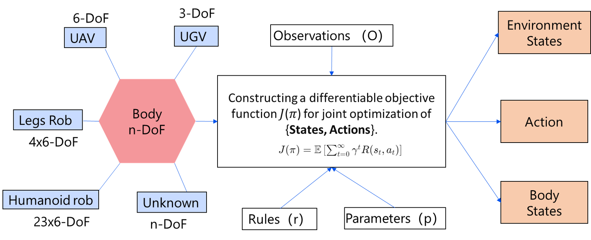

# Navigating the Physical World: A Survey of Embodied Navigation
This is a repository of embodied navigation survey led by **MSP** group from Shanghai Jiao Tong University. 

In this repository, you can learn the concept of embodied navigation and find the state-of-the-arts works related to this topic.
## Call for Cooperators: Join Us in Advancing Embodied Navigation Research
We are excited to invite researchers and experts in the field of embodied navigation to collaborate on an innovative paper aimed at pushing the boundaries of autonomous navigation systems. Our goal is to explore the intersection of interactive perception, neuromorphic cognition, and evolutionary motion capabilities in the development of cutting-edge embodied navigation systems.(Contact: sjtu4742986@sjtu.edu.cn)

## 1. Embodied Navigation Paradigm and Elements

### 1.1 Definition
The **Embodied Navigation System** is a fully autonomous navigation system with interactive perception, neuromorphic cognition, and evolutionary motion capabilities.
### 1.2 Embodied Navigation Paradigm

Given an intelligent agent with a certain degree of freedom, which follows specific motion rules and has hardware parameters, equipped with sensors capable of acquiring extensive environmental observations, we aim to establish a differentiable objective function. This function is designed for joint optimization of the state space and motion space, providing outputs for environment state, motion execution, and agent state.

The primary characteristic of this paradigm lies in the **joint optimization and solving of the agent's state, environmental state, and agent motion**. In contrast to prior navigation methods that may have focused solely on optimizing the agent's state, or SLAM problems which crucially consider the agent and environment, embodied navigation **additionally optimizes its own motion execution**.
### 1.3 Key Elements of Embodied Navigation

|Embodied Navigation|Traditional Navigation|
|-------------------|----------------------|
|Ego-centric|Global Axis|
|Multi Nodes, n-DoF|Single Node, <=6DoF|
|Evolved Motion Skills|Fixed Movement|
|Autonomous Task Decomposition and Multi-Task Joint Optimization|Manual Task Decomposition for Individual Optimization|
|First Principles|Engineering-Oriented Approach|
|Weak Metricity|Precise Metricity|
|Active Interaction Between Agent and Environment|Passive Perception|

## 2. Interactive Perception

### 2.1 Environmental Perception

#### Multimodal

##### Embodied Perception Devices

|Modality| Regular Camera | Fisheye Camera | 360 Camera | Infrared Camera | Event Camera | LiDAR | Millimeter-wave Radar | GNSS |
|--------|----------------|----------------|------------|-----------------|--------------|-------|-----------------------|------|
|**Features**| Widely used | Wide FOV      | Omi FOV    | Night Vision    | High Dynamic | 3D Pointclouds| Weather | Global|

##### Multimodal Fusion Methods
###### Filter
| Algorithms   |Date| Publication| Paper | Code |
|----------|----|------------|------|---|
###### Optimization
| Algorithms   |Date| Publication| Paper | Code |
|----------|----|------------|------|---|
###### Learning
| Algorithms   |Date| Publication| Paper | Code |
|----------|----|------------|------|---|

#### Multitask
##### Semantic Segmentation
| Algorithms   |Date| Publication| Paper | Code |
|----------|----|------------|------|---|
##### Object Recognition
| Algorithms   |Date| Publication| Paper | Code |
|----------|----|------------|------|---|
##### Place Recognition
| Algorithms   |Date| Publication| Paper | Code |
|----------|----|------------|------|---|
##### Object Pose Estimation
| Algorithms   |Date| Publication| Paper | Code |
|----------|----|------------|------|---|

### 2.2 Ontological Perception
#### Multi-node

- Embodied Carriers (Ontological Sensors, Observation Angles)
    - Vehicle
    - Robotic Dog
    - Drone
    - Humanoid Robot
    - IMU
    - Tactile Sensors
    - Angular Encoders
    - Motor Encoders
- Degree of Freedom Estimation
    - 3-DoF
    - 6-DoF
    - 6*nDoF
    - nDoF

#### Multi-state

- Master-Slave Node States
    - HPE
- Uncertainty Estimation
    - Filtering
    - Optimization
    - Uncertainty in DL

### 2.3 Multi-body Perception

#### Multi-agent

- Collaborative Platforms
    - Multiple Drones
    - Drone + Unmanned Vehicle
    - Multiple Robotic Dogs

#### Multi-information

- Different Perspectives
    - Air-Ground Perspective
    - Ground-Ground Perspective
    - Air-Air Perspective
- Heterogeneous Modality Information
    - 2D-3D
    - 3D-3D
    - 2D-2D

### 2.4 Interactive Perception

#### Body-Environment Interaction

- Active Exploration
    - Active SLAM
    - Vision-Touch Fusion

#### Environment-Environment Interaction

- Place Recognition
    - Loop Closure
    - Relocalization

#### Multi-body Interaction

- Perception Association
    - Overlapping Matching
- Communication
    - Information Compression
    - Transmission Medium

## 3. Neuromorphic Cognition

### 3.1 Spatial Cognition

#### Spatial Representation

- Explicit
    - Voxels
    - Octomap
    - VDB Series
- Implicit
    - NerF Series
    - 3D-GS

#### Spatial Storage

- Continuous Euclidean
    - High-Precision Maps
- Topological Non-Euclidean
    - Cognitive Maps

### 3.2 Ontological Cognition

#### Ontological Motion Representation

- Classic
- Learning

#### Ontological Motion Semantics

- Classification
- Natural Language

### 3.3 Task Cognition

#### Multilevel Cognition

- LLM

#### Multimodal Cognition

- Multimodal

### 3.4 Full Cognition Fusion

#### Cognitive Association

#### Cognitive Evolution

## 4. Motion Execution

### 4.1 Ontological Skills

#### Meta-Skills (Meaning, Definition, Classification in Multi-Carrier)

- Traditional Platforms: Drone, Unmanned Vehicle, Quadruped Platform
- Skill Types: Fly, Run, Walk...
- Relationship between Skills and Terrain Passability

#### Multi-Skill Learning

- Transfer
- Reinforcement

### 4.2 Planning and Control

#### Path Planning

- Classic Path Planning
    - Graph Search Based
    - Interpolating Curve Based
    - Sampling Based
    - Numerical Optimization Based
- Learning-Based Path Planning
    - Supervised Learning
    - Self-Supervised Learning
    - Reinforcement Learning

#### Motion Control

- Single-Body Control 
- Cluster Control

### 4.3 Morphological Coordination

#### Morphological Transformation

#### Agile Coordination

## 5. Platforms and Data

### 5.1 Hardware Platforms

### 5.2 Simulation Platforms

### 5.3 Open Datasets

## 6. Challenges in Embodied Navigation

## 7. Conclusion and Outlook
