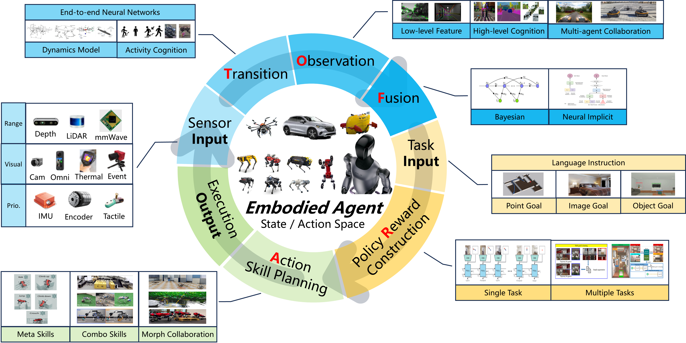

# Navigating the Physical World: A Survey of Embodied Navigation

This is a repository of embodied navigation survey **led by MSP group from Shanghai Jiao Tong University**. 

In this repository, you can learn the concept of embodied navigation and find the state-of-the-arts works related to this topic. 

If you find this repository helpful, please consider Stars ⭐ or Sharing ⬆️.
## Call for Cooperators: Join Us in Advancing Embodied Navigation Research
We are excited to invite researchers and experts in the field of embodied navigation to collaborate on an innovative paper aimed at pushing the boundaries of autonomous navigation systems. Our goal is to explore the intersection of interactive perception, neuromorphic cognition, and evolutionary motion capabilities in the development of cutting-edge embodied navigation systems.(Contact: sjtu4742986@sjtu.edu.cn)

## 1. Embodied Navigation Paradigm and Elements

Embodied navigation (EN) is a novel problem of conducting advanced egocentric navigation tasks through state estimation, task cognition and motion execution for an autonomous robot. Compared with traditional navigation, EN is stressed with the key features of 1) egocentric sensing, 2) interactive engagement with the environment through high degrees of freedom in actions and 3) high-level cognition for complex tasks.

Firstly, the EN system requires the configuration of state modeling and action capabilities to define the state and action space, as well as the initial state distribution \( b(\mathbf{s}_0) \). The EN system operates through the following stages:

1. **State Transition (T)**  
   The key aspect of this stage is to configure [T(\mathbf{s}_t | \mathbf{s}_{t-1}, \mathbf{a}_t)], so that the prior 
   [\hat{b}(\mathbf{s}_{t}) = \sum_{\mathbf{s}_t \in \mathcal{S}} T(\mathbf{s}_t | \mathbf{s}_{t-1}, \mathbf{a}_t) b(\mathbf{s}_{t-1})] 
   is computed.

2. **Observation (O)**  
   In this stage, the EN system acquires environmental observation by ego perceptive sensors to determine 
   \[
   O(\mathbf{o}_t | \mathbf{s}_t, \mathbf{a}_t).
   \]

3. **Fusion (F)**  
   This stage fuses the information from \( \hat{b}(\mathbf{s}_{t}) \) and \( O(\mathbf{o}_t | \mathbf{s}_t, \mathbf{a}_t) \) to compute the optimal state distribution 
   \[
   b(\mathbf{s}_t) = F(O(\mathbf{o}_t | \mathbf{s}_t, \mathbf{a}_t), \hat{b}(\mathbf{s}_{t})).
   \]

4. **Task Reward Construction (R)**  
   Based on the task cognition, the EN system evaluates the contribution of current action \( \mathbf{a}_t \) and \( \mathbf{s}_t \) to the navigation goal and calculates the reward 
   \[
   r(\mathbf{s}_t, \mathbf{a}_t) = \sum_{\mathbf{s}_t \in \mathcal{S}} R(\mathbf{s}_t, \mathbf{a}_t) b(\mathbf{s}_t).
   \]

5. **Action (A)**  
   Finally, the EN system optimizes the action sequence \( \{\mathbf{a}_0, \mathbf{a}_1, \mathbf{a}_2, \ldots\} \) by the skills of the agent to maximize the expectation of the accumulated reward 
   \[
   E\left[\sum_{t=0}^{\infty} r^t \cdot r(\mathbf{s}_t, \mathbf{a}_t)\right],
   \] 
   thereby efficiently achieving the navigation goals.

|Embodied Navigation|Traditional Navigation|
|-------------------|----------------------|
|Ego-centric|Global Axis|
|Multi Nodes, n-DoF|Single Node, <=6DoF|
|Evolved Motion Skills|Fixed Movement|
|Autonomous Task Decomposition and Multi-Task Joint Optimization|Manual Task Decomposition for Individual Optimization|
|First Principles|Engineering-Oriented Approach|
|Weak Metricity|Precise Metricity|
|Active Interaction Between Agent and Environment|Passive Perception|

## 2. Interactive Perception

### Surrunding Environment -Task

#### Object Detection

| Algorithm | Modality | Object Type | Date | Publication | Paper Link | Code |
| --- | --- | --- | --- | --- | --- | --- |
| DCGNN | LiDAR | Single-state 3D object | 2023 | CAIS | [Link](https://link.springer.com/article/10.1007/s40747-022-00926-z) | --- |
| ContrastZSD | CAM | Zero-shot Object | 2024 | IEEE TPAMI | [Link](https://arxiv.org/pdf/2109.06062) | --- |
| Gfocal | CAM  | Dense object | 2023  | IEEE TPAMI  | [Link](https://ieeexplore.ieee.org/document/9792391) | --- |
| DeepGCNs | Point cloud |---| 2023 | IEEE TPAMI | [Link](https://arxiv.org/pdf/1910.06849) | [code](https://github.com/lightaime/deep_gcns_torch) |
| GCNet |---|---| 2023 | IEEE TPAMI | [Link](https://ieeexplore.ieee.org/document/9307278) | [code](https://github.com/xvjiarui/GCNet) |
| CNN hybrid module(CSWin+hybrid patch embedding module+slicing-based inference)  | RGB image            | objects in UAV images                | 2023 | J-STARS  | [link](https://ieeexplore.ieee.org/document/10006385)                                                              |                                          |
| iS-YOLOv5     | RGB image            | small objects in autonomous driving  | 2023 | Pattern Recognition Letters| [link](https://www.sciencedirect.com/science/article/abs/pii/S0167865523000727?via%3Dihub)                         |                                          |
| ASIF-Net                             | RGB-D                | Salient Object                       | 2021 | IEEE T Cybernetics        | [link](https://ieeexplore.ieee.org/document/8998588)                                                               | [code](https://github.com/Li-Chongyi/ASIF-Net) |
| AdaDet(based on Early-Exit Neural Networks)                                               | RGB image            | ...                                  | 2024 | IEEE T COGN DEV SYST      | [link](https://ieeexplore.ieee.org/document/10121781)                                         |                           |
| memory network+causal intervention+Mask RCNN                                              | RGB/grayscale image  | object in different weather condition| 2024 | IEEE TPAMI                | [link](https://ieeexplore.ieee.org/document/9756301)                                                               |                                          |
| Res2Net                                                                                   | RGB image                  | object on 2D frames, especially Salient Object | 2021 | IEEE TPAMI                | [link](https://arxiv.org/pdf/1904.01169)           | [code](https://mmcheng.net/res2net/)     |

#### Place Recognization

| Algorithm | Modality | Date | Publication | Paper Link | Code |
| --- | --- | --- | --- | --- | --- |
| R2former | Cam | 2023 | CVPR | [Link](https://openaccess.thecvf.com/content/CVPR2023/papers/Zhu_R2Former_Unified_Retrieval_and_Reranking_Transformer_for_Place_Recognition_CVPR_2023_paper.pdf) | [Code](https://github.com/Jeff-Zilence/R2Former) |
| Eigenplaces | Cam | 2023 | ICCV | [Link](https://openaccess.thecvf.com/content/ICCV2023/papers/Berton_EigenPlaces_Training_Viewpoint_Robust_Models_for_Visual_Place_Recognition_ICCV_2023_paper.pdf) | [Code](https://github.com/gmberton/EigenPlaces) |
| Anyloc | Cam | 2023 | RAL | [Link](https://ieeexplore.ieee.org/stamp/stamp.jsp?tp=&arnumber=10361537) | [Code](https://anyloc.github.io/) |
| Optimal transport aggregation for visual place recognition | Cam | 2023 | ArXiv | [Link](https://arxiv.org/pdf/2311.15937) | [Code](https://github.com/serizba/salad) |
| Seqot | LiDAR | 2022 | TIE | [Link](https://ieeexplore.ieee.org/stamp/stamp.jsp?tp=&arnumber=9994714) | [Code](https://github.com/BIT-MJY/SeqOT) |
| Lpd-net | LiDAR | 2019 | ICCV | [Link](https://openaccess.thecvf.com/content_ICCV_2019/papers/Liu_LPD-Net_3D_Point_Cloud_Learning_for_Large-Scale_Place_Recognition_and_ICCV_2019_paper.pdf) | |
| Bevplace | LiDAR | 2023 | ICCV | [Link](https://openaccess.thecvf.com/content/ICCV2023/papers/Luo_BEVPlace_Learning_LiDAR-based_Place_Recognition_using_Birds_Eye_View_Images_ICCV_2023_paper.pdf) | [Code](https://github.com/zjuluolun/BEVPlace) |
| Adafusion | Cam-LiDAR | 2022 | RAL | [Link](https://ieeexplore.ieee.org/stamp/stamp.jsp?tp=&arnumber=9905898) | |
| Mff-pr | Cam-LiDAR | 2022 | ISMAR | [Link](https://ieeexplore.ieee.org/stamp/stamp.jsp?tp=&arnumber=9995604) | |
| Lcpr | Cam-LiDAR | 2023 | RAL | [Link](https://ieeexplore.ieee.org/stamp/stamp.jsp?tp=&arnumber=10373064) | |
| Explicit Interaction for Fusion-Based Place Recognition | Cam-LiDAR | 2024 | ArXiv | [Link](https://arxiv.org/pdf/2402.17264) | |

#### Semantic Classification

| Algorithm | Modality | Semantic Type | Date | Publication | Link |
|-----------|----------|---------------|------|-------------|------|
| Reinforcement Learning with Phase Transition Mechanism | Visual | Object Recognition and Goal Navigation | 2023 | arXiv | [arXiv](https://arxiv.org/abs/2311.03357) |
| Active Neural SLAM with Semantic Segmentation | Visual | Object Classification and Goal Localization | 2022 | NeurIPS | [NeurIPS Proceedings](https://proceedings.neurips.cc/paper/2022/hash/1d941784422e243c0c4a0a0aa5d1fd21-Abstract.html) |
| Reinforcement Learning with Communication and Feature Fusion Modules | Visual and Semantic Maps | Object and Scene Understanding | 2021 | arXiv | [arXiv](https://arxiv.org/abs/2109.09531) |
| Multitask Learning with Attentive Architecture | Visual, Audio, and Text | Multi-Modal Object and Scene Classification | 2022 | NeurIPS | [NeurIPS Proceedings](https://papers.nips.cc/paper_files/paper/2022/hash/ef4f2a0232a246b8a502135175e08953-Abstract-Conference.html) |
| Self-supervised Learning with Multi-Head Attention | Visual and Language | 3D Object Recognition and Language Understanding | 2022 | arXiv | [arXiv](https://arxiv.org/abs/2201.10788) |
| Deep Reinforcement Learning | Visual | Scene and Object Classification | 2021 | CVPR | [CVPR 2021](https://openaccess.thecvf.com/content/CVPR2021/html/Chaplot_Learning_Visual_Representations_for_Perception_and_Navigation_CVPR_2021_paper.html) |
| Curriculum Learning | Visual | Object and Scene Recognition | 2020 | ICLR | [ICLR 2020](https://openreview.net/forum?id=rJgllpVYvr) |
| Vision-Language Models | Visual and Language | Object Detection and Language Understanding | 2023 | arXiv | [arXiv](https://arxiv.org/abs/2301.05678) |
| Semantic Mapping and Coordination | Visual and Semantic Maps | Object and Scene Classification | 2022 | IEEE Robotics and Automation Letters | [IEEE Xplore](https://ieeexplore.ieee.org/document/9651200) |
| Scene Priors with Reinforcement Learning | Visual | Scene and Object Classification | 2021 | ICCV | [ICCV 2021](https://openaccess.thecvf.com/content/ICCV2021/html/Zhu_Visual_Semantic_Navigation_Using_Scene_Priors_ICCV_2021_paper.html) |

### Ego State -Body

#### Wheeled Vehicle

| Algorithm | Modality | Date | Publication | Paper Link | Code |
| --- | --- | --- | --- | --- | --- |
| Doppler-only Single-scan 3D Vehicle Odometry | Radar | 2023 | ArXiv | [Link](https://arxiv.org/abs/2310.04113) |  |
| PhaRaO | Radar | 2020 | ICRA | [Link](https://ieeexplore.ieee.org/document/9197231/) |  |
| RadarSLAM | Radar | 2020 | IROS | [Link](https://ieeexplore.ieee.org/abstract/document/9341287?casa_token=4_fyBqP1zNMAAAAA:HSNPEsdToMbn01O6omMm5OadK2fAS9Gq__dcFqXpxvIppWtZU-ERASPj-5fgAhotDYvaCOrf5A) |  |
| 4DRadarSLAM | Radar | 2023 | ICRA | [Link](https://ieeexplore.ieee.org/document/10160670/) | [Code](https://github.com/zhuge2333/4DRadarSLAM) |
| LIC-Fusion | Lidar-IMU-Cam | 2019 | IROS | [Link](https://ieeexplore.ieee.org/document/8967746/) |  |
| LIC-Fusion 2.0 | Lidar-IMU-Cam | 2020 | IROS | [Link](https://ieeexplore.ieee.org/abstract/document/9340704) |  |
| Faster-LIO | Lidar-IMU | 2022 | RAL | [Link](https://ieeexplore.ieee.org/abstract/document/9718203) | [Code](http://github.com/gaoxiang12/faster-lio) |
| LOAM | Lidar | 2014 | RSS | [Link](https://www.ri.cmu.edu/pub_files/2014/7/Ji_LidarMapping_RSS2014_v8.pdf) |  |
| LeGO-LOAM | Lidar | 2018 | IROS | [Link](https://ieeexplore.ieee.org/document/8594299) |  |

#### Drone

| Algorithm | Modality | Date | Publication | Paper Link | Code |
| --- | --- | --- | --- | --- | --- |
| Fast-LIO | Lidar-IMU | 2021 | RAL | [link](https://ieeexplore.ieee.org/abstract/document/9372856) | [code](https://github.com/hku-mars/FAST_LIO) |
|Swarm-LIO|LiDar-IMU|2023|ICRA|[link](https://ieeexplore.ieee.org/document/10161355)|[code](https://github.com/hku-mars/Swarm-LIO2)|
|Vision-UWB fusion framework|UGV-assisted|2023|IEEE ICIEA|[link](https://ieeexplore.ieee.org/document/10241577)| |
|EKF+ IGG robust estimation|GNSS+INS+IMU+Force sensor|2024|MEAS SCI TECHNOL|[link](https://iopscience.iop.org/article/10.1088/1361-6501/acfe2a)|[code](https://github.com/ZJU-FAST-Lab/VID-Dataset)|
|Omni-Swarm(multidrone map-based localization+visual drone tracking)|VIO+UWB sensors+stereo wide-field-of-view cameras|2022|IEEE T ROBOT|[link](https://arxiv.org/pdf/2103.04131)|[code](https://github.com/HKUST-Aerial-Robotics/Omni-swarm)|
|EKF|ToF+?|2024|AMC|[link](https://ieeexplore.ieee.org/document/10505698)| |
|HDVIO|VIO+IMU+dynamics module|2023|RSS|[link](https://arxiv.org/pdf/2306.11429)| |
|Acoustic Inertial Measurement(AIM)|Acoustics(microphone array)|2022|ACM(SenSys)|[link](https://dl.acm.org/doi/pdf/10.1145/3560905.3568499)| |

#### Legged Robot

| Algorithm | Modality | Date | Publication | Paper Link | Code |
| --- | --- | --- | --- | --- | --- |
| Direct LiDAR Odometry | LiDAR | 2022 | RAL | [Link](https://ieeexplore.ieee.org/document/9681177) |  |
| MIPO | IMU-Kinematics | 2023 | IROS | [Link](https://ieeexplore.ieee.org/document/10342061) | [Code](https://github.com/ShuoYangRobotics/Multi-IMU-Proprioceptive-Odometry) |
| Robust Legged Robot State Estimation Using Factor Graph Optimization | Cam-IMU-Kinematics | 2019 | RAL | [Link](https://ieeexplore.ieee.org/document/8790726) |  |
| VILENS | Cam-IMU-Lidar-Kinematics | 2023 | TRO | [Link](https://ieeexplore.ieee.org/document/9852710) |  |
| Invariant Smoother for Legged Robot State Estimation | IMU-Kinematics | 2023 | TRO | [Link](https://ieeexplore.ieee.org/document/10301546) |  |
| Cerberus | Cam-IMU-Kinematics | 2023 | ICRA | [Link](https://ieeexplore.ieee.org/document/10160486) | [Code](https://github.com/ShuoYangRobotics/Cerberus) |
| On State Estimation for Legged Locomotion Over Soft Terrain | IMU-Kinematics | 2021 | IEEE Sensors Letters | [Link](https://ieeexplore.ieee.org/document/9316716) |  |
| Event Camera-based Visual Odometry | Event Cam-RGBD | 2023 | IROS | [Link](https://ieeexplore.ieee.org/document/10342048) |  |
| Pronto | Cam-IMU-Lidar-Kinematics | 2020 | Frontiers in Robotics and AI | [Link](https://www.frontiersin.org/journals/robotics-and-ai/articles/10.3389/frobt.2020.00068/full) | [Code](https://github.com/ori-drs/pronto) |
| Legged Robot State Estimation With Dynamic Contact Event Information | IMU-Kinematics | 2021 | RAL | [Link](https://ieeexplore.ieee.org/document/9468900) |  |
| Vision-Assisted Localization and Terrain Reconstruction with Quadruped Robots | Depth-IMU-Lidar | 2022 | IROS | [Link](https://ieeexplore.ieee.org/document/9981897) |  |

#### Humanoid/Human

 **Algorithm** | **Modality** | **Semantic Type** | **Date** | **Publication** | **Link** |
|---------------|--------------|--------------------|----------|-----------------|----------|
| Social Dynamics Adaptation (SDA) | Depth images, ResNet, Recurrent Policy Network | Human Trajectories, Motion Policy | 2024 | arXiv | [Link](https://arxiv.org/abs/2404.11327) |
| SMPL Body Model, Motion Retargeting | Motion Capture, SMPL Parameters | Human Motion, Humanoid Motion Imitation | 2024 | arXiv | [Link](https://arxiv.org/abs/2403.04436) |
| Humanoid Shadowing Transformer, Imitation Transformer | Optical Marker-based Motion Capture, RGB Camera | Human Body and Hand Data, Pose Estimation | 2024 | arXiv | [Link](https://arxiv.org/abs/2406.10454) |
 | Remote Teleoperation Architecture | Fiber Optic Network, Virtual Reality Equipment | Teleoperation, Human-Robot Interaction | 2022 | arXiv | [Link](https://arxiv.org/abs/2203.06972) |
 | POMDP, Reinforcement Learning | Motion Capture, Force-Controlled Actuators | Human Motion, Robot Locomotion | 2024 | arXiv | [Link](https://arxiv.org/abs/2402.18294) |
 | Modular Learning Framework, Imitation Learning | Motion Capture, Human Demonstrations | Humanoid Behaviors, Task Learning | 2021 | IEEE Robotics and Automation Letters | [Link](https://ieeexplore.ieee.org/document/9353392) |
| Zero-Shot Learning with CLIP Embeddings | RGB-D Camera | Object Navigation | 2022 | CVPR | [Link](https://openaccess.thecvf.com/content/CVPR2022/html/Zhao_CLIP_on_Wheels_Zero-Shot_Object_Navigation_as_Object_Localization_and_Exploration_CVPR_2022_paper.html) |
 | Reinforcement Learning | Visual Inputs (RGB Camera) | Open-World Navigation | 2021 | ICRA | [Link](https://ieeexplore.ieee.org/document/9401222) |
 | Reinforcement Learning with Gesture Recognition | Multimodal (Gestures, Visual Inputs) | Human-Robot Interaction | 2023 | CVPR | [Link](https://openaccess.thecvf.com/content/CVPR2023/papers/Norton_Communicative_Learning_with_Natural_Gestures_for_Embodied_Navigation_CVPR_2023_paper.html) |
 | Vision-Language Model, Self-Supervised Learning | Visual and Language Inputs | Instruction Following | 2020 | CVPR | [Link](https://openaccess.thecvf.com/content_CVPR_2020/papers/Wang_Vision-Language_Navigation_with_Self-Supervised_Auxiliary_Reasoning_Tasks_CVPR_2020_paper.html) |
 | Simulation-Based Learning | Visual and Physical Simulation | Physical Interaction Prediction | 2020 | CVPR | [Link](https://openaccess.thecvf.com/content_CVPR_2020/papers/Ehsani_Use_the_Force_Luke_Learning_to_Predict_Physical_Forces_by_CVPR_2020_paper.html) |

### Collabrative Sensing -View

#### Sky-Ground

| Algorithm | Modality | Date | Publication | Paper Link | Code |
| --- | --- | --- | --- | --- | --- |
| Graph‐based subterranean exploration path planning using aerial and legged robots | Cam-Depth-Lidar-Thermal-IMU | 2020 | Journal of Field Robotics | [Link](https://onlinelibrary.wiley.com/doi/10.1002/rob.21993) |  |
| Stronger Together | Cam-Lidar-GNSS | 2022 | RAL | [Link](https://ieeexplore.ieee.org/document/9830880) | [Code](https://github.com/iandouglas96/asoom_oss) |
| VIO-UWB-Based Collaborative Localization and Dense Scene Reconstruction within Heterogeneous Multi-Robot Systems | Depth-Lidar | 2022 | ICARM | [Link](https://onlinelibrary.wiley.com/doi/10.1002/rob.21993) |  |
| Heterogeneous Ground and Air Platforms, Homogeneous Sensing: Team CSIRO Data61's Approach to the DARPA Subterranean Challenge | Cam-Lidar | 2022 | Field Robotics | [Link](https://arxiv.org/abs/2104.09053) |  |
| Aerial-Ground Collaborative Continuous Risk Mapping for Autonomous Driving of Unmanned Ground Vehicle in Off-Road Environments | Depth-Lidar-IMU | 2023 | TAES | [Link](https://www.sciencedirect.com/science/article/abs/pii/S0360132322005820) | [Code](https://github.com/ininwrc/agccrm) |
| Cooperative Route Planning for Fuel-constrained UGV-UAV Exploration | Cam-Lidar-GNSS | 2022 | ICUS | [Link](https://ieeexplore.ieee.org/document/9987158) |  |
| Energy-Efficient Ground Traversability Mapping Based on UAV-UGV Collaborative System | Cam-Lidar | 2022 | TGCN | [Link](https://ieeexplore.ieee.org/document/9521583) |  |
| Aerial-Ground Robots Collaborative 3D Mapping in GNSS-Denied Environments | Cam-Lidar | 2022 | ICRA | [Link](https://ieeexplore.ieee.org/document/9812319) |  |
| Autonomous Exploration and Mapping System Using Heterogeneous UAVs and UGVs in GPS-Denied Environments | Cam-Depth-Lidar | 2019 | TVT | [Link](https://ieeexplore.ieee.org/document/8598942) |  |

#### Sky-Sky

| Algorithm | Modality | Date | Publication | Paper Link | Code |
| --- | --- | --- | --- | --- | --- |
| Joint Optimization of UAV Deployment and Directional Antenna Orientation |  | 2023 | WCNC | [Link](https://ieeexplore.ieee.org/document/10118837) |  |
| Multi-UAV Collaborative Sensing and Communication: Joint Task Allocation and Power Optimization |  | 2023 | TWC | [Link](https://ieeexplore.ieee.org/document/9968197) |  |
| Decentralized Multi-UAV Cooperative Exploration Using Dynamic Centroid-Based Area Partition | Depth | 2023 | Drones | [Link](https://www.mdpi.com/2504-446X/7/6/337) |  |
| Cooperative 3D Exploration and Mapping using Distributed Multi-Robot Teams | Lidar | 2024 | ICARSC | [Link](https://ieeexplore.ieee.org/document/10535925) |  |
| RACER | Cam-IMU | 2023 | TRO | [Link](https://ieeexplore.ieee.org/document/10038280) | [Code](https://github.com/SYSU-STAR/RACER) |
| Fast Multi-UAV Decentralized Exploration of Forests | Depth | 2023 | RAL | [Link](https://ieeexplore.ieee.org/document/10184313) | [Code](https://github.com/VIS4ROB-lab/fast_multi_robot_exploration) |
| Next-Best-View planning for surface reconstruction of large-scale 3D environments with multiple UAVs | Depth | 2020 | IROS | [Link](https://ieeexplore.ieee.org/document/9340897) |  |
| An autonomous unmanned aerial vehicle system for fast exploration of large complex indoor environments | Cam-Lidar | 2021 | Journal of Field Robotics | [Link](https://onlinelibrary.wiley.com/doi/abs/10.1002/rob.22021) | [Code](https://github.com/ctu-mrs/mrs_uav_system) |
| Multi‑MAV Autonomous Full Coverage Search in Cluttered Forest Environments | Cam-Lidar | 2022 | Journal of Intelligent & Robotic Systems | [Link](https://link.springer.com/article/10.1007/s10846-022-01723-z) |  |

#### Ground-Ground

| Algorithm | Modality | Date | Publication | Paper Link | Code |
| --- | --- | --- | --- | --- | --- |
| Hybrid Stochastic Exploration Using Grey Wolf Optimizer and Coordinated Multi-Robot Exploration Algorithms |  | 2019 | IEEE Access | [Link](https://ieeexplore.ieee.org/document/8631022) |  |
| MR-TopoMap | Cam-Lidar | 2022 | RAL | [Link](https://ieeexplore.ieee.org/document/9834084) |  |
| H2GNN |  | 2022 | RAL | [Link](https://ieeexplore.ieee.org/document/9697333) |  |
| SMMR-Explore | Lidar-IMU | 2021 | ICRA | [Link](https://ieeexplore.ieee.org/document/9561328) |  |
| Distributed multi-robot potential-field-based exploration with submap-based mapping and noise-augmented strategy | Lidar | 2024 | Robotics and Autonomous Systems | [Link](https://www.sciencedirect.com/science/article/abs/pii/S0921889024001362) |  |
| CoPeD-Advancing Multi-Robot Collaborative Perception | Cam-Lidar-GNSS-IMU | 2024 | RAL | [Link](https://ieeexplore.ieee.org/document/10540310) |  |
| Collaborative Complete Coverage and Path Planning for Multi-Robot Exploration |  | 2021 | Sensors | [Link](https://www.mdpi.com/1424-8220/21/11/3709) |  |
| Voronoi-Based Multi-Robot Autonomous Exploration in Unknown Environments via Deep Reinforcement Learning | Lidar | 2020 | TVT | [Link](https://ieeexplore.ieee.org/document/9244647) |  |
| Multi-vehicle cooperative localization and mapping with the assistance of dynamic beacons in GNSS-denied environment | IMU-Lidar | 2024 | ISAS | [Link](https://ieeexplore.ieee.org/document/10552478) |  |

## 3. Advanced Cognition

### Global/Local Space -Representation

#### Point

| Algorithm | Based Structure | Date | Publication | Paper Link | Code |
| --- | --- | --- | --- | --- | --- |
| Point Cloud Library (PCL)  | Point cloud | 2011 | ICRA | [link](https://doi.org/10.1109/ICRA.2011.5980567) |  |
| PointNet | Point cloud | 2017 | CVPR | [link](https://openaccess.thecvf.com/content_cvpr_2017/html/Qi_PointNet_Deep_Learning_CVPR_2017_paper.html) |  |
| PCT                                                  | Point cloud                                  | 2021 | computational visual media    | [link](https://arxiv.org/pdf/2012.09688)                   |                                             |
| TEASER|Point cloud                                 | 2021 | IEEE T ROBOT                  | [link](https://ieeexplore.ieee.org/document/9286491)       |                                             |
| SC-CNN                                               | point cloud+hierarchical+anisotropic spatial geometry | 2022 | TRGS                          | [link](https://ieeexplore.ieee.org/document/9762976)       | [code](https://github.com/changshuowang/SC-CNN) |
| PMP-Net++                                            | Point cloud                                  | 2023 | IEEE TPAMI                    | [link](https://arxiv.org/pdf/2202.09507)                   | [code](https://github.com/diviswen/PMP-Net) |
| STORM                                                | Point cloud                                  | 2023 | IEEE TPAMI                    | [link](https://ieeexplore.ieee.org/document/9705149)       |                                             |
| Registration by Graph Matching                       | deep graph+point cloud                       | 2023 | IEEE TPAMI                    | [link](https://arxiv.org/pdf/2211.04696)                   | [code](https://github.com/fukexue/RGM)      |
| CrossNet                                             | RGB+grayscale+point cloud                    | 2024 | TMM                           | [link](https://ieeexplore.ieee.org/document/10147273)      |                                             |
| PointConT                                            | point content-based Transformer              | 2024 | JAS                           | [link](https://arxiv.org/pdf/2303.04599)                   | [code](https://github.com/yahuiliu99/PointConT) |

#### Voxel

| Algorithm | Based Structure | Date | Publication | Paper Link | Code |
| --- | --- | --- | --- | --- | --- |
| Direct Voxel Grid Optimization | voxel grid  | 2022 | CVPR | [link](https://openaccess.thecvf.com/content/CVPR2022/html/Sun_Direct_Voxel_Grid_Optimization_Super-Fast_Convergence_for_Radiance_Fields_Reconstruction_CVPR_2022_paper.html) |  |
| NICE-SLAM | multireslutional voxel grid | 2022 | CVPR | [link](https://openaccess.thecvf.com/content/CVPR2022/html/Zhu_NICE-SLAM_Neural_Implicit_Scalable_Encoding_for_SLAM_CVPR_2022_paper.html) |  |
| Instant neural graphics primitives with a multiresolution hash encoding  | voxel grid hash encoding  | 2022 | ACM Transactions on Graphics | [link](https://doi.org/10.1145/3528223.3530127) |  |
| Vox-Fusion | voxel grid with octree | 2022 | ISMAR | [link](https://doi.org/10.1109/ISMAR55827.2022.00066) |  |
| Occupancy Networks | occupancy grid | 2019 | CVPR | [link](https://openaccess.thecvf.com/content_CVPR_2019/html/Mescheder_Occupancy_Networks_Learning_3D_Reconstruction_in_Function_Space_CVPR_2019_paper.html) |  |

#### Neural Weights

| Algorithm | Based Structure | Date | Publication | Paper Link | Code |
| --- | --- | --- | --- | --- | --- |
| NeRF  | MLP | 2022 | ACM Transactions on Graphics | [link](https://dl.acm.org/doi/10.1145/3528223.3530127) |  |
| 3D-GS  | 3D-GS  | 2023 | ACM Transactions on Graphics | [link](https://doi.org/10.48550/arXiv.2308.04079) |  |
| NerF-LOAM | Neural-SDF | 2023 | ICCV | [link](https://openaccess.thecvf.com/content/ICCV2023/papers/Deng_NeRF-LOAM_Neural_Implicit_Representation_for_Large-Scale_Incremental_LiDAR_Odometry_and_ICCV_2023_paper.pdf) |  |
| DeepSDF | MLP-SDF/TSDF | 2019 | CVPR | [link](https://openaccess.thecvf.com/content_CVPR_2019/html/Park_DeepSDF_Learning_Continuous_Signed_Distance_Functions_for_Shape_Representation_CVPR_2019_paper.html) |  |

### Ego Motion -Semantic

#### Action Recognization

| Algorithm | Modality | Date | Publication | Paper Link | Code |
| --- | --- | --- | --- | --- | --- |
| Egocentric Action Recognition by Automatic Relation Modeling | Egocentric RGB Videos | 2023 | TPAMI | [link](https://ieeexplore.ieee.org/abstract/document/9706375) |  |
| Egocentric Human Activities Recognition With Multimodal Interaction Sensing | Egocentric RGB Videos+IMU | 2024 | IEEE Sensors Journal | [link](https://ieeexplore.ieee.org/abstract/document/10387162) |  |
| Ego-Humans | Egocentric RGB Videos | 2023 | ICCV | [link](https://openaccess.thecvf.com/content/ICCV2023/html/Khirodkar_Ego-Humans_An_Ego-Centric_3D_Multi-Human_Benchmark_ICCV_2023_paper.html) |  |
| E2(GO)MOTION | Egocentric Event Stream Videos | 2022 | CVPR | [link](https://openaccess.thecvf.com/content/CVPR2022/html/Plizzari_E2GOMOTION_Motion_Augmented_Event_Stream_for_Egocentric_Action_Recognition_CVPR_2022_paper.html) |  |
| Towards Continual Egocentric Activity Recognition: A Multi-Modal Egocentric Activity Dataset for Continual Learning | Egocentric RGB Videos+IMU | 2024 | IEEE Transactions on Multimedia | [link](https://ieeexplore.ieee.org/abstract/document/10184468) |  |
| MARS | IMU | 2021 | IEEE Internet of Things Journal | [link](https://ieeexplore.ieee.org/abstract/document/9343342) |  |
| Multi-level Contrast Network for Wearables-based Joint Activity Segmentation and Recognition | IMU | 2022 | Globecom | [link](https://ieeexplore.ieee.org/abstract/document/10001226) |  |
| Timestamp-Supervised Wearable-Based Activity Segmentation and Recognition With Contrastive Learning and Order-Preserving Optimal Transport | IMU | 2024 | TMC | [link](https://ieeexplore.ieee.org/abstract/document/10478562) |  |

#### Motion to Languange

| Algorithm | Modality | Date | Publication | Paper Link | Code |
| --- | --- | --- | --- | --- | --- |
| MotionGPT | IMU | 2023 | NIPS | [link](https://proceedings.neurips.cc/paper_files/paper/2023/hash/3fbf0c1ea0716c03dea93bb6be78dd6f-Abstract-Conference.html) |  |
| IMUGPT 2.0 | IMU | 2024 | ArXiv | [link](https://arxiv.org/abs/2402.01049) |  |
|APSR framework|depth/3D joint information/RGB frame/IR sequence|2020|IEEE TPAMI|[link](https://ieeexplore.ieee.org/document/8713892) | |
|MS block+Res2Net|2D RGB images|2023|IEEE TCSVT|[link](https://ieeexplore.ieee.org/document/9950528)|   |
|EM+Dijkstra|IMU|2020|IEEE T HUM-MACH SYST|[link](https://ieeexplore.ieee.org/document/8954775)|  |
|MotionLLM | |2024|arxiv|[link](https://www.arxiv.org/pdf/2405.17013v2)|[code](https://github.com/szqwu/MotionLLM)|
|Seq2Seq+SeqGAN+RL+MC|CAM+Master Motor Map framework|2021|ICRA|[link](https://ieeexplore.ieee.org/document/9561519)|   |
|KIT (a datasheet)|CAM+Master Motor Map framework|2017|Big Data|[link](https://arxiv.org/pdf/1607.03827)|[datasheet](https://motion-annotation.humanoids.kit.edu/dataset/)|
|Motion Patches+ViT framework|3D joint position+RGB 2D images|2024|arxiv|[link](https://arxiv.org/pdf/2405.04771)|  |
### Goal Understanding -Type

#### Point

#### Image

| No. | Algorithm | Modality | Semantic Type | Date | Publication | Link |
|-----|-----------|----------|----------------|------|-------------|------|
| 1 | Deep Learning | Visual | Image Segmentation | 02/2022 | IEEE Transactions on Intelligent Transportation Systems | [Link](https://ieeexplore.ieee.org/document/9693127) |
| 2 | CNNs | Visual | Image Understanding | 06/2021 | Neural Networks | [Link](https://www.sciencedirect.com/science/article/pii/S089360802100078X) |
| 3 | Semantic Localization and Mapping | Visual | Image Recognition | 03/2023 | Robotics and Autonomous Systems | [Link](https://www.sciencedirect.com/science/article/pii/S0921889022004371) |
| 4 | Vision-Based Learning | Visual | Image Recognition | 05/2023 | International Journal of Robotics Research | [Link](https://journals.sagepub.com/doi/10.1177/02783649231102812) |
| 5 | Deep Learning | Visual | Image Analysis | 08/2021 | Pattern Recognition Letters | [Link](https://www.sciencedirect.com/science/article/pii/S0167865521002864) |
| 6| Integrated Semantic Mapping | Visual | Image Recognition | 04/2022 | Robotics | [Link](https://www.mdpi.com/2218-6581/11/2/12) |
| 7 | Deep Learning | Visual | Image Segmentation | 02/2023 | Journal of Field Robotics | [Link](https://onlinelibrary.wiley.com/doi/10.1002/rob.22063) |
| 8 | Advanced Semantic Analysis | Visual | Image Understanding | 06/2023 | Autonomous Robots | [Link](https://link.springer.com/article/10.1007/s10514-023-09910-9) |
#### Object

| No. | Algorithm | Modality | Semantic Type | Date | Publication | Link |
|-----|-----------|----------|----------------|------|-------------|------|
| 1 | PPO | Visual | Object Recognition | 09/2021 | arXiv | [Link](https://ar5iv.labs.arxiv.org/html/2109.09531) |
| 2 | XgX | Visual | Object Detection | 11/2023 | arXiv | [Link](https://ar5iv.labs.arxiv.org/html/2311.03357) |
| 3 | Deep RL | Visual | Object Recognition | 01/2022 | Journal of Intelligent & Robotic Systems | [Link](https://link.springer.com/article/10.1007/s10846-021-01384-8) |
| 4 | Cross-Modal Learning | Visual/Textual | Object Detection | 04/2022 | IEEE Robotics and Automation Letters | [Link](https://ieeexplore.ieee.org/document/9735167) |
| 5 | Goal-Oriented Exploration | Visual | Object Detection | 03/2021 | CVPR | [Link](https://openaccess.thecvf.com/content/CVPR2021/papers/Yang_Object-Goal_Navigation_Using_Goal-Oriented_Semantic_Exploration_CVPR_2021_paper.pdf) |
| 6 | Deep RL | Visual | Object Segmentation | 07/2022 | Sensors | [Link](https://www.mdpi.com/1424-8220/22/14/5142) |
| 7 | Multi-Task Learning | Visual | Object Localization | 12/2021 | IEEE Transactions on Neural Networks and Learning Systems | [Link](https://ieeexplore.ieee.org/document/9586214) |
| 8 | DCNNs | Visual | Scene Understanding | 10/2022 | Pattern Recognition | [Link](https://www.sciencedirect.com/science/article/pii/S003132032200375X) |
| 9 | Spatial Attention Mechanism | Visual | Object Detection | 06/2021 | Robotics and Autonomous Systems | [Link](https://www.sciencedirect.com/science/article/pii/S0921889021000696) |
| 10 | Real-Time Semantic Mapping | Visual | Object Recognition | 05/2023 | International Journal of Advanced Robotic Systems | [Link](https://journals.sagepub.com/doi/10.1177/17298814221102941) |

## 4. Motion Execution

### Skills -

#### Meta

| Algorithm | Date | Publication | Paper Link | Code |
| --- | --- | --- | --- | --- |
| Learning hand-eye coordination for robotic grasping with deep learning and large-scale data collection | 2018 | IJRR | [Link](https://journals.sagepub.com/doi/full/10.1177/0278364917710318) |  |
| Learning ambidextrous robot grasping policies | 2019 | Science Robotics | [Link](https://www.science.org/doi/10.1126/scirobotics.aau4984) |  |
| Learning Synergies between Pushing and Grasping with Self-supervised Deep Reinforcement Learning | 2018 | IROS | [Link](https://ieeexplore.ieee.org/document/8593986) |  |
| GraspNet-1Billion: A Large-Scale Benchmark for General Object Grasping | 2020 | CVPR | [Link](https://ieeexplore.ieee.org/document/9156992) | [Code](www.graspnet.net) |
| AnyGrasp: Robust and Efficient Grasp Perception in Spatial and Temporal Domains | 2023 | TRO | [Link](https://ieeexplore.ieee.org/document/10167687) |  |
| Unsupervised Reinforcement Learning of Transferable Meta-Skills for Embodied Navigation | 2020 | CVPR | [Link](https://arxiv.org/abs/1911.07450) |  |
| UMI on Legs: Making Manipulation Policies Mobile with Manipulation-Centric Whole-body Controllers | 2024 | arXiv | [Link](https://arxiv.org/abs/2407.10353) | [Code](https://github.com/real-stanford/umi-on-legs) |
| DrEureka: Language Model Guided Sim-To-Real Transfer | 2024 | RSS | [Link](https://arxiv.org/abs/2406.01967) | [Code](https://github.com/eureka-research/DrEureka) |
| Humanoid Locomotion as Next Token Prediction | 2024 | arXiv | [Link](https://arxiv.org/abs/2402.19469) |  |

#### Combination

| Algorithm | Date | Publication | Paper Link | Code |
| --- | --- | --- | --- | --- |
| Learning compositional models of robot skills for task and motion planning | 2021 | ISRR | [Link](https://journals.sagepub.com/doi/10.1177/02783649211004615) | [Code](https://github.com/caelan/LTAMP) |
| Learning Manipulation Skills via Hierarchical Spatial Attention | 2022 | TRO | [Link](https://ieeexplore.ieee.org/document/9023569) |  |
| Lifelong Robot Library Learning: Bootstrapping Composable and Generalizable Skills for Embodied Control with Language Models | 2024 | ICRA | [Link](https://arxiv.org/abs/2406.18746) | [Code](https://gtziafas.github.io/LRLL_project/) |
| SAGCI-System | 2022 | ICRA | [Link](https://ieeexplore.ieee.org/document/9811859) |  |
| Pedipulate: Enabling Manipulation Skills using a Quadruped Robot’s Leg | 2024 | ICRA | [Link](https://arxiv.org/abs/2402.10837) |  |
| PhyPlan | 2024 | arxiv | [Link](https://arxiv.org/abs/2406.00001) | [Code](https://github.com/phyplan/PhyPlan) |
| Practice Makes Perfect: Planning to Learn Skill Parameter Policies | 2024 | RSS | [Link](https://arxiv.org/abs/2402.15025) | [Code](https://github.com/bdaiinstitute/predicators/releases/tag/planning-to-practice-ees) |
| Extreme Parkour with Legged Robots | 2024 | ICRA | [Link](https://arxiv.org/abs/2309.14341) | [Code](https://github.com/chengxuxin/extreme-parkour) |
| WoCoCo: Learning Whole-Body Humanoid Control with Sequential Contacts | 2024 | arXiv | [Link](https://arxiv.org/abs/2406.06005) |  |
| HiLMa-Res: A General Hierarchical Framework via Residual RL for Combining Quadrupedal Locomotion and Manipulation | 2024 | IROS | [Link](https://www.arxiv.org/abs/2407.06584) |  |
| Robust and Versatile Bipedal Jumping Control through Multi-Task Reinforcement Learning | 2023 | RSS | [Link](https://arxiv.org/abs/2302.09450) |  |
| Real-World Humanoid Locomotion with Reinforcement Learning | 2024 | Science Robotics | [Link](https://arxiv.org/abs/2303.03381) |  |

### Planning

| Algorithm | Modality | DoF | Date | Publication | Paper Link | Code |
| --- | --- | --- | --- | --- | --- | --- |
| iPlanner | Depth | 2-D | 2023 | RSS | [Link](https://www.roboticsproceedings.org/rss19/p064.html) |  |
| ViPlanner | RGB-D | 2-D | 2024 | ICRA | [Link](https://leggedrobotics.github.io/viplanner.github.io/) |  |
| DTC: Deep Tracking Control | Depth | 1/2-D | 2024 | Science Robotics | [Link](https://www.science.org/doi/10.1126/scirobotics.adh5401) |  |
| Neural RRT* | RGB | 2-D | 2020 | IEEE Transactions on Automation Science and Engineering | [Link](https://ieeexplore.ieee.org/abstract/document/9037111) |  |
| Socially aware motion planning with deep reinforcement learning | Stereo RGB | 2-D | 2017 | IROS | [Link](https://ieeexplore.ieee.org/abstract/document/8202312) |  |
| Efficient Autonomous Exploration Planning of Large-Scale 3-D Environments | RGB | 3-D | 2019 | RAL | [Link](https://ieeexplore.ieee.org/abstract/document/8633925) |  |
| ArtPlanner: Robust Legged Robot Navigation in the Field | RGB-D | 2.5-D | 2021 | Journal of Field Robotics | [Link](https://arxiv.org/abs/2303.01420) | [Code](https://github.com/leggedrobotics/art_planner) |
| Perceptive Whole Body Planning for Multi-legged Robots in Confined Spaces | RGB-D | 3-D | 2021 | Journal of Field Robotics | [Link](https://www.research-collection.ethz.ch/handle/20.500.11850/419575) |  |
| Versatile Multi-Contact Planning and Control for Legged Loco-Manipulation | RGB-D | 3-D | 2023 | Science Robotics | [Link](https://www.science.org/doi/10.1126/scirobotics.adg5014) |  |
| Learning to walk in confined spaces using 3D representation | RGB-D/LiDAR | 3-D | 2024 | ICRA | [Link](https://arxiv.org/abs/2403.00187) | [Code](https://github.com/leggedrobotics/terrain-generator) |
| VLFM: Vision-Language Frontier Maps for Zero-Shot Semantic Navigation | RGB-D | 2-D | 2024 | ICRA | [Link](https://arxiv.org/abs/2312.03275) | [Code](https://github.com/bdaiinstitute/vlfm) |
| Autonomous Navigation of Underactuated Bipedal Robots in Height-Constrained Environments. | RGB-D | 3-D | 2023 | IJRR | [Link](https://arxiv.org/abs/2109.05714) |  |
|  |  |  |  |  |  |  |

### Morphological Collabration -Morphologic

| Algorithm | Morphologic | Date | Publication | Paper Link | Code |
| --- | --- | --- | --- | --- | --- |
| Learning Robust Autonomous Navigation and Locomotion for Wheeled-legged Robots | Wheel-leg | 2024 | Science Robotics | [Link](https://www.science.org/stoken/author-tokens/ST-1825/full) |  |
| SytaB | Ground-Air | 2022 | RAL | [Link](https://ieeexplore.ieee.org/abstract/document/9832723) |  |
| Aerial-aquatic robots capable of crossing the air-water boundary and hitchhiking on surfaces | ground-air-water | 2022 | Science Robotics | [Link](https://www.science.org/doi/full/10.1126/scirobotics.abm6695) |  |
| Advanced Skills through Multiple Adversarial Motion Priors in
Reinforcement Learning | Wheel-leg | 2023 | ICRA | [Link](https://www.youtube.com/watch?v=kEdr0ARq48A) |  |
| Curiosity-Driven Learning of Joint Locomotion and Manipulation Tasks | Wheel-leg | 2023 | PMLR | [Link](https://proceedings.mlr.press/v229/schwarke23a.html) |  |
| Offline motion libraries and online MPC for advanced mobility skills | Wheel-leg | 2022 | IJRR | [Link](https://journals.sagepub.com/doi/full/10.1177/02783649221102473) |  |
| Whole-body mpc and online gait sequence generation for wheeled-legged robots | Wheel-leg | 2021 | IROS | [Link](https://ieeexplore.ieee.org/abstract/document/9636371) |  |
| Skywalker | Ground-Air | 2023 | RAL |  |  |
| Autonomous and Adaptive Navigation for Terrestrial-Aerial Bimodal Vehicles | Ground-Air | 2022 | RAL | [Link](https://ieeexplore.ieee.org/abstract/document/9691888) |  |
| ManyQuadrupeds: Learning a Single Locomotion Policy for Diverse Quadruped Robots | Quadrupedal | 2024 | ICRA | [Link](https://arxiv.org/abs/2310.10486) |  |
| Body Transformer: Leveraging Robot Embodiment for Policy Learning | Legged | 2024 | arXiv | [Link](https://arxiv.org/abs/2408.06316) |  |
| Learning Bipedal Walking on a Quadruped Robot via Adversarial Motion Priors | Legged | 2024 | arXiv | [Link](https://arxiv.org/abs/2407.02282) |  |

## 5. Platforms and Data

### Simulation

| Algorithm | Date | Publication | Paper Link | Code |
| --- | --- | --- | --- | --- |
| RFUniverse: A Multiphysics Simulation Platform for Embodied AI | 2023 | arxiv | [Link](https://arxiv.org/abs/2202.00199) | [Code](https://github.com/robotflow-initiative/rfuniverse) |

### Reality

## 6. Open Research Problems

### Adaptive Scale and Complex Environment

### Joint Optimization

### Generality

## 6. Conclusions

## 7. Acknowledgement

