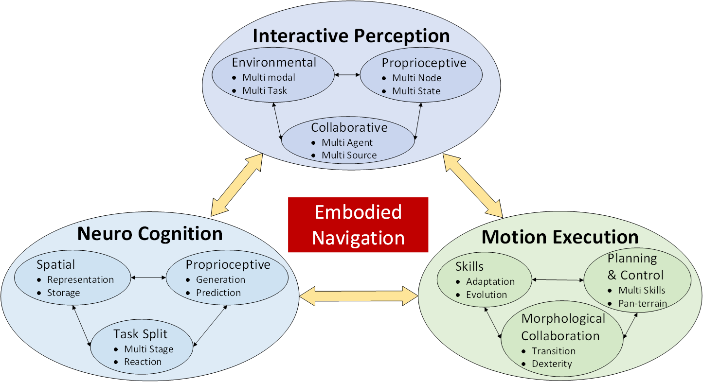
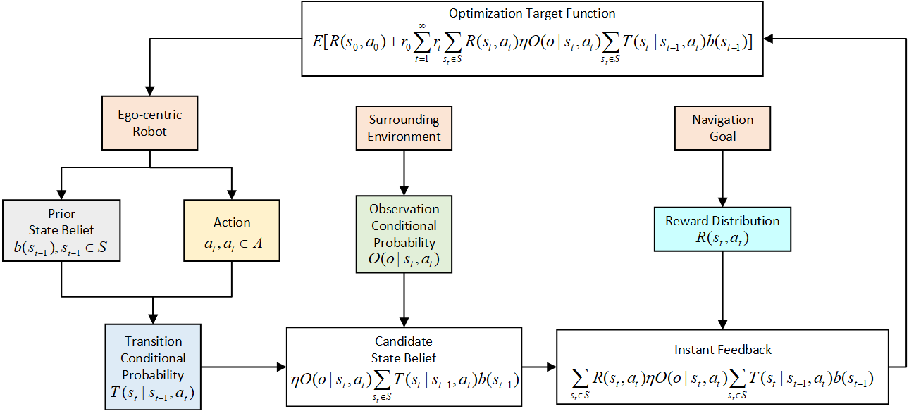
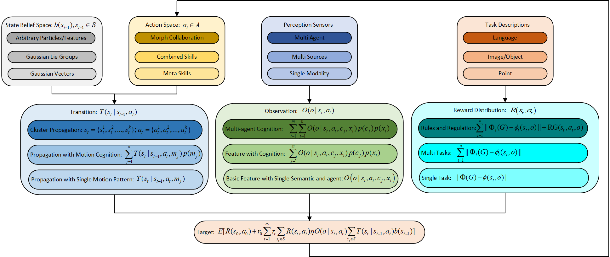

# Navigating the Physical World: A Survey of Embodied Navigation

This is a repository of embodied navigation survey **led by MSP group from Shanghai Jiao Tong University**. 

In this repository, you can learn the concept of embodied navigation and find the state-of-the-arts works related to this topic. 

If you find this repository helpful, please consider Stars ⭐ or Sharing ⬆️.
## Call for Cooperators: Join Us in Advancing Embodied Navigation Research
We are excited to invite researchers and experts in the field of embodied navigation to collaborate on an innovative paper aimed at pushing the boundaries of autonomous navigation systems. Our goal is to explore the intersection of interactive perception, neuromorphic cognition, and evolutionary motion capabilities in the development of cutting-edge embodied navigation systems.(Contact: sjtu4742986@sjtu.edu.cn)

## 1. Embodied Navigation Paradigm and Elements

### 1.1 Definition
The **Embodied Navigation System** is a fully autonomous navigation system with **Interactive Perception**, **Neuromorphic Cognition**, and **Motion Execution** capabilities.

### 1.2 Embodied Navigation Paradigm
Given an intelligent agent with a certain degree of freedom, which follows specific motion rules and has hardware parameters, equipped with sensors capable of acquiring extensive environmental observations, we aim to establish a differentiable objective function. This function is designed for joint optimization of the state space and motion space, providing outputs for environment state, motion execution, and agent state.

The primary characteristic of this paradigm lies in the **joint optimization and solving of the agent's state, environmental state, and agent motion**. In contrast to prior navigation methods that may have focused solely on optimizing the agent's state, or SLAM problems which crucially consider the agent and environment, embodied navigation **additionally optimizes its own motion execution**.

To better describe the problem setup of embodied navigation, we use the random process for modeling of the framework.

To better understand the modules in the framework, we define several levels of each module. The darker colors mean more advanced levels.

### 1.3 Key Elements of Embodied Navigation

|Embodied Navigation|Traditional Navigation|
|-------------------|----------------------|
|Ego-centric|Global Axis|
|Multi Nodes, n-DoF|Single Node, <=6DoF|
|Evolved Motion Skills|Fixed Movement|
|Autonomous Task Decomposition and Multi-Task Joint Optimization|Manual Task Decomposition for Individual Optimization|
|First Principles|Engineering-Oriented Approach|
|Weak Metricity|Precise Metricity|
|Active Interaction Between Agent and Environment|Passive Perception|

## 2. Interactive Perception

### Surrunding Environment -Task

#### Object Detection

| Algorithm | Modality | Object Type | Date | Publication | Paper Link | Code |
| --- | --- | --- | --- | --- | --- | --- |
|  |  |  |  |  |  |  |
|  |  |  |  |  |  |  |

#### Place Recognization

| Algorithm | Modality | Date | Publication | Paper Link | Code |
| --- | --- | --- | --- | --- | --- |
| R2former | Cam | 2023 | CVPR | [Link](https://openaccess.thecvf.com/content/CVPR2023/papers/Zhu_R2Former_Unified_Retrieval_and_Reranking_Transformer_for_Place_Recognition_CVPR_2023_paper.pdf) | [Code](https://github.com/Jeff-Zilence/R2Former) |
| Eigenplaces | Cam | 2023 | ICCV | [Link](https://openaccess.thecvf.com/content/ICCV2023/papers/Berton_EigenPlaces_Training_Viewpoint_Robust_Models_for_Visual_Place_Recognition_ICCV_2023_paper.pdf) | [Code](https://github.com/gmberton/EigenPlaces) |
| Anyloc | Cam | 2023 | RAL | [Link](https://ieeexplore.ieee.org/stamp/stamp.jsp?tp=&arnumber=10361537) | [Code](https://anyloc.github.io/) |
| Optimal transport aggregation for visual place recognition | Cam | 2023 | ArXiv | [Link](https://arxiv.org/pdf/2311.15937) | [Code](https://github.com/serizba/salad) |
| Seqot | LiDAR | 2022 | TIE | [Link](https://ieeexplore.ieee.org/stamp/stamp.jsp?tp=&arnumber=9994714) | [Code](https://github.com/BIT-MJY/SeqOT) |
| Lpd-net | LiDAR | 2019 | ICCV | [Link](https://openaccess.thecvf.com/content_ICCV_2019/papers/Liu_LPD-Net_3D_Point_Cloud_Learning_for_Large-Scale_Place_Recognition_and_ICCV_2019_paper.pdf) | |
| Bevplace | LiDAR | 2023 | ICCV | [Link](https://openaccess.thecvf.com/content/ICCV2023/papers/Luo_BEVPlace_Learning_LiDAR-based_Place_Recognition_using_Birds_Eye_View_Images_ICCV_2023_paper.pdf) | [Code](https://github.com/zjuluolun/BEVPlace) |
| Adafusion | Cam-LiDAR | 2022 | RAL | [Link](https://ieeexplore.ieee.org/stamp/stamp.jsp?tp=&arnumber=9905898) | |
| Mff-pr | Cam-LiDAR | 2022 | ISMAR | [Link](https://ieeexplore.ieee.org/stamp/stamp.jsp?tp=&arnumber=9995604) | |
| Lcpr | Cam-LiDAR | 2023 | RAL | [Link](https://ieeexplore.ieee.org/stamp/stamp.jsp?tp=&arnumber=10373064) | |
| Explicit Interaction for Fusion-Based Place Recognition | Cam-LiDAR | 2024 | ArXiv | [Link](https://arxiv.org/pdf/2402.17264) | |

#### Semantic Classification

| Algorithm | Modality | Semantic Type | Date | Publication | Paper Link | Code |
| --- | --- | --- | --- | --- | --- | --- |
|  |  |  |  |  |  |  |
|  |  |  |  |  |  |  |

### Ego State -Body

#### Wheeled Vehicle

| Algorithm | Modality | Date | Publication | Paper Link | Code |
| --- | --- | --- | --- | --- | --- |
| Doppler-only Single-scan 3D Vehicle Odometry | Radar | 2023 | ArXiv | [Link](https://arxiv.org/abs/2310.04113) |  |
| PhaRaO | Radar | 2020 | ICRA | [Link](https://ieeexplore.ieee.org/document/9197231/) |  |
| RadarSLAM | Radar | 2020 | IROS | [Link](https://ieeexplore.ieee.org/abstract/document/9341287?casa_token=4_fyBqP1zNMAAAAA:HSNPEsdToMbn01O6omMm5OadK2fAS9Gq__dcFqXpxvIppWtZU-ERASPj-5fgAhotDYvaCOrf5A) |  |
| 4DRadarSLAM | Radar | 2023 | ICRA | [Link](https://ieeexplore.ieee.org/document/10160670/) | [Code](https://github.com/zhuge2333/4DRadarSLAM) |
| LIC-Fusion | Lidar-IMU-Cam | 2019 | IROS | [Link](https://ieeexplore.ieee.org/document/8967746/) |  |
| LIC-Fusion 2.0 | Lidar-IMU-Cam | 2020 | IROS | [Link](https://ieeexplore.ieee.org/abstract/document/9340704) |  |
| Faster-LIO | Lidar-IMU | 2022 | RAL | [Link](https://ieeexplore.ieee.org/abstract/document/9718203) | [Code](http://github.com/gaoxiang12/faster-lio) |
| LOAM | Lidar | 2014 | RSS | [Link](https://www.ri.cmu.edu/pub_files/2014/7/Ji_LidarMapping_RSS2014_v8.pdf) |  |
| LeGO-LOAM | Lidar | 2018 | IROS | [Link](https://ieeexplore.ieee.org/document/8594299) |  |

#### Drone

| Algorithm | Modality | Date | Publication | Paper Link | Code |
| --- | --- | --- | --- | --- | --- |
| Fast-LIO | Lidar-IMU | 2021 | RAL | https://ieeexplore.ieee.org/abstract/document/9372856 | https://github.com/hku-mars/FAST_LIO |
|  |  |  |  |  |  |

#### Legged Robot

| Algorithm | Modality | Date | Publication | Paper Link | Code |
| --- | --- | --- | --- | --- | --- |
| Direct LiDAR Odometry | LiDAR | 2022 | RAL | https://ieeexplore.ieee.org/document/9681177 |  |
|  |  |  |  |  |  |

#### Humanoid/Human

 **Algorithm** | **Modality** | **Semantic Type** | **Date** | **Publication** | **Link** |
|---------------|--------------|--------------------|----------|-----------------|----------|
| Social Dynamics Adaptation (SDA) | Depth images, ResNet, Recurrent Policy Network | Human Trajectories, Motion Policy | 2024 | arXiv | [Link](https://arxiv.org/abs/2404.11327) |
| SMPL Body Model, Motion Retargeting | Motion Capture, SMPL Parameters | Human Motion, Humanoid Motion Imitation | 2024 | arXiv | [Link](https://arxiv.org/abs/2403.04436) |
| Humanoid Shadowing Transformer, Imitation Transformer | Optical Marker-based Motion Capture, RGB Camera | Human Body and Hand Data, Pose Estimation | 2024 | arXiv | [Link](https://arxiv.org/abs/2406.10454) |
 | Remote Teleoperation Architecture | Fiber Optic Network, Virtual Reality Equipment | Teleoperation, Human-Robot Interaction | 2022 | arXiv | [Link](https://arxiv.org/abs/2203.06972) |
 | POMDP, Reinforcement Learning | Motion Capture, Force-Controlled Actuators | Human Motion, Robot Locomotion | 2024 | arXiv | [Link](https://arxiv.org/abs/2402.18294) |
 | Modular Learning Framework, Imitation Learning | Motion Capture, Human Demonstrations | Humanoid Behaviors, Task Learning | 2021 | IEEE Robotics and Automation Letters | [Link](https://ieeexplore.ieee.org/document/9353392) |
| Zero-Shot Learning with CLIP Embeddings | RGB-D Camera | Object Navigation | 2022 | CVPR | [Link](https://openaccess.thecvf.com/content/CVPR2022/html/Zhao_CLIP_on_Wheels_Zero-Shot_Object_Navigation_as_Object_Localization_and_Exploration_CVPR_2022_paper.html) |
 | Reinforcement Learning | Visual Inputs (RGB Camera) | Open-World Navigation | 2021 | ICRA | [Link](https://ieeexplore.ieee.org/document/9401222) |
 | Reinforcement Learning with Gesture Recognition | Multimodal (Gestures, Visual Inputs) | Human-Robot Interaction | 2023 | CVPR | [Link](https://openaccess.thecvf.com/content/CVPR2023/papers/Norton_Communicative_Learning_with_Natural_Gestures_for_Embodied_Navigation_CVPR_2023_paper.html) |
 | Vision-Language Model, Self-Supervised Learning | Visual and Language Inputs | Instruction Following | 2020 | CVPR | [Link](https://openaccess.thecvf.com/content_CVPR_2020/papers/Wang_Vision-Language_Navigation_with_Self-Supervised_Auxiliary_Reasoning_Tasks_CVPR_2020_paper.html) |
 | Simulation-Based Learning | Visual and Physical Simulation | Physical Interaction Prediction | 2020 | CVPR | [Link](https://openaccess.thecvf.com/content_CVPR_2020/papers/Ehsani_Use_the_Force_Luke_Learning_to_Predict_Physical_Forces_by_CVPR_2020_paper.html) |

### Collabrative Sensing -View

#### Sky-Ground

| Algorithm | Modality | Date | Publication | Paper Link | Code |
| --- | --- | --- | --- | --- | --- |
|  |  |  |  |  |  |
|  |  |  |  |  |  |

#### Sky-Sky

| Algorithm | Modality | Date | Publication | Paper Link | Code |
| --- | --- | --- | --- | --- | --- |
|  |  |  |  |  |  |
|  |  |  |  |  |  |

#### Ground-Ground

| Algorithm | Modality | Date | Publication | Paper Link | Code |
| --- | --- | --- | --- | --- | --- |
|  |  |  |  |  |  |
|  |  |  |  |  |  |

## 3. Advanced Cognition

### Global/Local Space -Representation

#### Point

| Algorithm | Based Structure | Date | Publication | Paper Link | Code |
| --- | --- | --- | --- | --- | --- |
| Point Cloud Library (PCL)  | Point cloud | 2011 | ICRA | [link](https://doi.org/10.1109/ICRA.2011.5980567) |  |
| PointNet | Point cloud | 2017 | CVPR | [link](https://openaccess.thecvf.com/content_cvpr_2017/html/Qi_PointNet_Deep_Learning_CVPR_2017_paper.html) |  |

#### Voxel

| Algorithm | Based Structure | Date | Publication | Paper Link | Code |
| --- | --- | --- | --- | --- | --- |
| Direct Voxel Grid Optimization | voxel grid  | 2022 | CVPR | [link](https://openaccess.thecvf.com/content/CVPR2022/html/Sun_Direct_Voxel_Grid_Optimization_Super-Fast_Convergence_for_Radiance_Fields_Reconstruction_CVPR_2022_paper.html) |  |
| NICE-SLAM | multireslutional voxel grid | 2022 | CVPR | [link](https://openaccess.thecvf.com/content/CVPR2022/html/Zhu_NICE-SLAM_Neural_Implicit_Scalable_Encoding_for_SLAM_CVPR_2022_paper.html) |  |
| Instant neural graphics primitives with a multiresolution hash encoding  | voxel grid hash encoding  | 2022 | ACM Transactions on Graphics | [link](https://doi.org/10.1145/3528223.3530127) |  |
| Vox-Fusion | voxel grid with octree | 2022 | ISMAR | [link](https://doi.org/10.1109/ISMAR55827.2022.00066) |  |
| Occupancy Networks | occupancy grid | 2019 | CVPR | [link](https://openaccess.thecvf.com/content_CVPR_2019/html/Mescheder_Occupancy_Networks_Learning_3D_Reconstruction_in_Function_Space_CVPR_2019_paper.html) |  |

#### Neural Weights

| Algorithm | Based Structure | Date | Publication | Paper Link | Code |
| --- | --- | --- | --- | --- | --- |
| NeRF  | MLP | 2022 | ACM Transactions on Graphics | [link](https://dl.acm.org/doi/10.1145/3528223.3530127) |  |
| 3D-GS  | 3D-GS  | 2023 | ACM Transactions on Graphics | [link](https://doi.org/10.48550/arXiv.2308.04079) |  |
| NerF-LOAM | Neural-SDF | 2023 | ICCV | [link](https://openaccess.thecvf.com/content/ICCV2023/papers/Deng_NeRF-LOAM_Neural_Implicit_Representation_for_Large-Scale_Incremental_LiDAR_Odometry_and_ICCV_2023_paper.pdf) |  |
| DeepSDF | MLP-SDF/TSDF | 2019 | CVPR | [link](https://openaccess.thecvf.com/content_CVPR_2019/html/Park_DeepSDF_Learning_Continuous_Signed_Distance_Functions_for_Shape_Representation_CVPR_2019_paper.html) |  |

### Ego Motion -Semantic
| Algorithm | Modality | Semantic Type | Date | Publication | Link |
|-----------|----------|---------------|------|-------------|------|
| Reinforcement Learning with Phase Transition Mechanism | Visual | Object Recognition and Goal Navigation | 2023 | arXiv | [arXiv](https://arxiv.org/abs/2311.03357) |
| Active Neural SLAM with Semantic Segmentation | Visual | Object Classification and Goal Localization | 2022 | NeurIPS | [NeurIPS Proceedings](https://proceedings.neurips.cc/paper/2022/hash/1d941784422e243c0c4a0a0aa5d1fd21-Abstract.html) |
| Reinforcement Learning with Communication and Feature Fusion Modules | Visual and Semantic Maps | Object and Scene Understanding | 2021 | arXiv | [arXiv](https://arxiv.org/abs/2109.09531) |
| Multitask Learning with Attentive Architecture | Visual, Audio, and Text | Multi-Modal Object and Scene Classification | 2022 | NeurIPS | [NeurIPS Proceedings](https://papers.nips.cc/paper_files/paper/2022/hash/ef4f2a0232a246b8a502135175e08953-Abstract-Conference.html) |
| Self-supervised Learning with Multi-Head Attention | Visual and Language | 3D Object Recognition and Language Understanding | 2022 | arXiv | [arXiv](https://arxiv.org/abs/2201.10788) |
| Deep Reinforcement Learning | Visual | Scene and Object Classification | 2021 | CVPR | [CVPR 2021](https://openaccess.thecvf.com/content/CVPR2021/html/Chaplot_Learning_Visual_Representations_for_Perception_and_Navigation_CVPR_2021_paper.html) |
| Curriculum Learning | Visual | Object and Scene Recognition | 2020 | ICLR | [ICLR 2020](https://openreview.net/forum?id=rJgllpVYvr) |
| Vision-Language Models | Visual and Language | Object Detection and Language Understanding | 2023 | arXiv | [arXiv](https://arxiv.org/abs/2301.05678) |
| Semantic Mapping and Coordination | Visual and Semantic Maps | Object and Scene Classification | 2022 | IEEE Robotics and Automation Letters | [IEEE Xplore](https://ieeexplore.ieee.org/document/9651200) |
| Scene Priors with Reinforcement Learning | Visual | Scene and Object Classification | 2021 | ICCV | [ICCV 2021](https://openaccess.thecvf.com/content/ICCV2021/html/Zhu_Visual_Semantic_Navigation_Using_Scene_Priors_ICCV_2021_paper.html) |

#### Action Recognization

| Algorithm | Modality | Date | Publication | Paper Link | Code |
| --- | --- | --- | --- | --- | --- |
| Egocentric Action Recognition by Automatic Relation Modeling | Egocentric RGB Videos | 2023 | TPAMI | [link](https://ieeexplore.ieee.org/abstract/document/9706375) |  |
| Egocentric Human Activities Recognition With Multimodal Interaction Sensing | Egocentric RGB Videos+IMU | 2024 | IEEE Sensors Journal | [link](https://ieeexplore.ieee.org/abstract/document/10387162) |  |
| Ego-Humans | Egocentric RGB Videos | 2023 | ICCV | [link](https://openaccess.thecvf.com/content/ICCV2023/html/Khirodkar_Ego-Humans_An_Ego-Centric_3D_Multi-Human_Benchmark_ICCV_2023_paper.html) |  |
| E2(GO)MOTION | Egocentric Event Stream Videos | 2022 | CVPR | [link](https://openaccess.thecvf.com/content/CVPR2022/html/Plizzari_E2GOMOTION_Motion_Augmented_Event_Stream_for_Egocentric_Action_Recognition_CVPR_2022_paper.html) |  |
| Towards Continual Egocentric Activity Recognition: A Multi-Modal Egocentric Activity Dataset for Continual Learning | Egocentric RGB Videos+IMU | 2024 | IEEE Transactions on Multimedia | [link](https://ieeexplore.ieee.org/abstract/document/10184468) |  |
| MARS | IMU | 2021 | IEEE Internet of Things Journal | [link](https://ieeexplore.ieee.org/abstract/document/9343342) |  |
| Multi-level Contrast Network for Wearables-based Joint Activity Segmentation and Recognition | IMU | 2022 | Globecom | [link](https://ieeexplore.ieee.org/abstract/document/10001226) |  |
| Timestamp-Supervised Wearable-Based Activity Segmentation and Recognition With Contrastive Learning and Order-Preserving Optimal Transport | IMU | 2024 | TMC | [link](https://ieeexplore.ieee.org/abstract/document/10478562) |  |

#### Motion to Languange

| Algorithm | Modality | Date | Publication | Paper Link | Code |
| --- | --- | --- | --- | --- | --- |
| MotionGPT | IMU | 2023 | NIPS | [link](https://proceedings.neurips.cc/paper_files/paper/2023/hash/3fbf0c1ea0716c03dea93bb6be78dd6f-Abstract-Conference.html) |  |
| IMUGPT 2.0 | IMU | 2024 | ArXiv | [link](https://arxiv.org/abs/2402.01049) |  |

### Goal Understanding -Type

#### Point

#### Image

#### Object

## 4. Motion Execution

### Skills -

#### Meta

#### Combination

### Planning

| Algorithm | Modality | DoF | Date | Publication | Paper Link | Code |
| --- | --- | --- | --- | --- | --- | --- |
| iPlanner | Depth | 2-D | 2023 | RSS | [link](https://www.roboticsproceedings.org/rss19/p064.html) |  |
| ViPlanner | RGB-D | 2-D | 2024 | ICRA | [link](https://leggedrobotics.github.io/viplanner.github.io/) |  |
| DTC: Deep Tracking Control | Depth | 12-D | 2024 | Science Robotics | [link](https://www.science.org/doi/10.1126/scirobotics.adh5401) |  |
| Neural RRT* | RGB | 2-D | 2020 | IEEE Transactions on Automation Science and Engineering | [link](https://ieeexplore.ieee.org/abstract/document/9037111) |  |
| Socially aware motion planning with deep reinforcement learning | Stereo RGB | 2-D | 2017 | IROS | [link](https://ieeexplore.ieee.org/abstract/document/8202312) |  |
| Efficient Autonomous Exploration Planning of Large-Scale 3-D Environments | RGB | 3-D | 2019 | RAL | [link](https://ieeexplore.ieee.org/abstract/document/8633925) |  |
|  |  |  |  |  |  |  |

### Morphological Collabration -Morphologic

| Algorithm | Morphologic | Date | Publication | Paper Link | Code |
| --- | --- | --- | --- | --- | --- |
| Learning Robust Autonomous Navigation and Locomotion for Wheeled-legged Robots | Wheel-leg | 2024 | Science Robotics | [link](https://www.science.org/stoken/author-tokens/ST-1825/full) |  |
| SytaB | Ground-Air | 2022 | RAL | [link](https://ieeexplore.ieee.org/abstract/document/9832723) |  |
| Aerial-aquatic robots capable of crossing the air-water boundary and hitchhiking on surfaces | ground-air-water | 2022 | Science Robotics | [link](https://www.science.org/doi/full/10.1126/scirobotics.abm6695) |  |
| Advanced Skills through Multiple Adversarial Motion Priors in
Reinforcement Learning | Wheel-leg | 2023 | ICRA | [link](https://www.youtube.com/watch?v=kEdr0ARq48A) |  |
| Curiosity-Driven Learning of Joint Locomotion and Manipulation Tasks | Wheel-leg | 2023 | PMLR | [link](https://proceedings.mlr.press/v229/schwarke23a.html) |  |
| Offline motion libraries and online MPC for advanced mobility skills | Wheel-leg | 2022 | IJRR | [link](https://journals.sagepub.com/doi/full/10.1177/02783649221102473) |  |
| Whole-body mpc and online gait sequence generation for wheeled-legged robots | Wheel-leg | 2021 | IROS | [link](https://ieeexplore.ieee.org/abstract/document/9636371) |  |
| Skywalker | Ground-Air | 2023 | RAL |  |  |
| Autonomous and Adaptive Navigation for Terrestrial-Aerial Bimodal Vehicles | Ground-Air | 2022 | RAL | [link](https://ieeexplore.ieee.org/abstract/document/9691888) |  |

## 5. Platforms and Data

### Simulation

### Reality

## 6. Open Research Problems

### Adaptive Scale and Complex Environment

### Joint Optimization

### Generality

## 6. Conclusions

## 7. Acknowledgement

