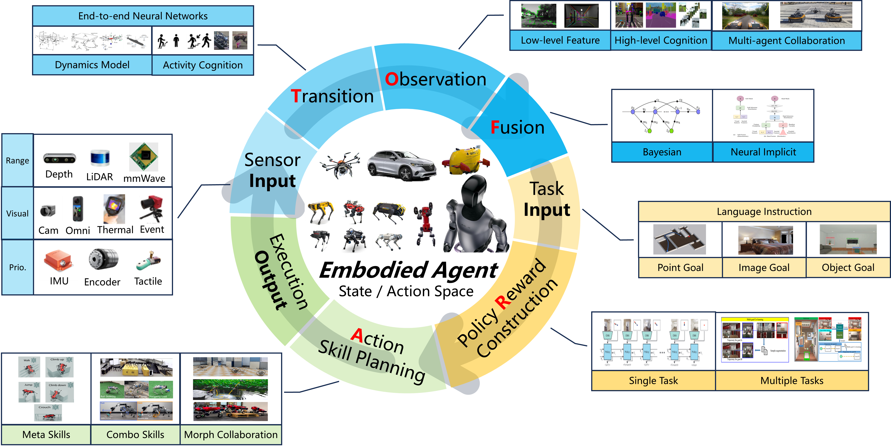

# Navigating the Physical World: A Survey of Embodied Navigation

This is a repository of embodied navigation survey **led by MSP group from Shanghai Jiao Tong University**. 

In this repository, you can learn the concept of embodied navigation and find the state-of-the-arts works related to this topic. 

If you find this repository helpful, please consider Stars ⭐ or Sharing ⬆️.

## 1. Embodied Navigation Paradigm and Elements

Embodied navigation (EN) is a novel problem of conducting advanced egocentric navigation tasks through state estimation, task cognition and motion execution for an autonomous robot. Compared with traditional navigation, EN is stressed with the key features of **1) egocentric sensing, 2) interactive engagement with the environment through high degrees of freedom in actions and 3) high-level cognition for complex tasks.**

Recently, an increasing number of works are proposed to solve the problems within the EN system. However, existing studies tend to focus on specific sub-issues, lacking a coherent and unified framework. Consequently, the systematic level and real-world application of EN now remain constrained due to the absence of a comprehensive problem formulation. **To this end, we propose a unified formulation for EN, structured into five stages: transition, observation, fusion, task reward construction and action skills optimization (TOFRA).**

|Embodied Navigation|Traditional Navigation|
|-------------------|----------------------|
|Ego-centric|Global Axis|
|Multi Nodes, n-DoF|Single Node, <=6DoF|
|Evolved Motion Skills|Fixed Movement|
|Autonomous Task Decomposition and Multi-Task Joint Optimization|Manual Task Decomposition for Individual Optimization|
|First Principles|Engineering-Oriented Approach|
|Weak Metricity|Precise Metricity|
|Active Interaction Between Agent and Environment|Passive Perception|

## 2. Summary and Integration of current works into TOFRA

### Space Configuration

| EN Space | Modules | Categories | Algorithm| Date | Publication | Paper Link | Code |
| --- | --- | --- | --- | --- | --- | --- | --- |
| State Space | Body | Vector | OpenVINS | 2020 | ICRA | [Link](https://ieeexplore.ieee.org/document/9196524) | [Link](https://github.com/rpng/open_vins) |
| State Space | Body | Vector | VINS-Mono | 2018 | TRO | [Link](https://ieeexplore.ieee.org/document/8421746) | [Link](https://github.com/HKUST-Aerial-Robotics/VINS-Mono) |
| State Space | Body | Lie Group | IEKF as a Stable Observer | 2017 | TAC | [Link](https://ieeexplore.ieee.org/document/7523335/authors#authors) | --- |
| State Space | Body | Lie Group | PIEKF-VIWO | 2023 | ICRA | [Link](https://ieeexplore.ieee.org/document/10160380) | --- |
| State Space | Body | Lie Group | Convergence and Consistency Analysis for a 3-D Invariant-EKF SLAM | 2017 | RA-L | [Link](https://ieeexplore.ieee.org/abstract/document/7812660) | --- |
| State Space | Body | Quaternion-Based | A Trident Quaternion Framework for Inertial-Based Navigation Part I: Rigid Motion Representation and Computation | 2022 | TAES | [Link](https://ieeexplore.ieee.org/document/9640520) | --- |
| State Space | Body | Implicit | Towards Versatile Embodied Navigation | 2022 | TAES | [Link](https://ieeexplore.ieee.org/document/9640520) | [Link](https://github.com/hanqingwangai/VXN) |
| State Space | Body | Implicit | Scene Memory Transformer for Embodied Agents in Long Time Horizon Tasks | 2019 | CVPR | [Link](https://openaccess.thecvf.com/content_CVPR_2019/html/Fang_Scene_Memory_Transformer_for_Embodied_Agents_in_Long-Horizon_Tasks_CVPR_2019_paper.html) | --- |
| State Space | Body | Implicit | Zero Experience Required | 2022 | CVPR | [Link](https://ieeexplore.ieee.org/abstract/document/9878587) | [Link](https://github.com/ziadalh/zero_experience_required) |
| State Space | Body | Neuromophic | - | - | - | - | - |
| State Space | Environment | Point Cloud | 3D is here | 2011 | ICRA | [Links](https://ieeexplore.ieee.org/document/5980567) | [Link](https://github.com/PointCloudLibrary/pcl) |
| State Space | Environment | Voxel | Occupancy Networks | 2019 | CVPR | [Links](https://ieeexplore.ieee.org/document/8953655) | [Link](https://github.com/autonomousvision/occupancy_networks) |
| State Space | Environment | Implicit | NeRF-LOAM | 2023 | ICCV | [Links](https://ieeexplore.ieee.org/document/10377635) | [Link](https://github.com/JunyuanDeng/NeRF-LOAM) |
| State Space | Environment | Neuromophic | - | - | - | - | - |
| Action Space | Low-level Control | Ground Wheel Vehicles | Are we ready for autonomous driving | 2012 | CVPR | [Link](https://ieeexplore.ieee.org/document/6248074) | --- |
| Action Space | Low-level Control | Ground Wheel Vehicles | CARLA | 2017 | CARLA | [Link](https://proceedings.mlr.press/v78/dosovitskiy17a/dosovitskiy17a.pdf) | [Link](https://github.com/carla-simulator/carla) |
| Action Space | Low-level Control | UAVs/AUVs | Unmanned Aerial Vehicles (UAVs) | 2019 | IEEE Access | [Link](https://ieeexplore.ieee.org/document/8682048) | - |
| Action Space | Low-level Control | UAVs/AUVs | AUV Navigation and Localization | 2014 | JOE | [Link](https://ieeexplore.ieee.org/document/6678293) | - |
| Action Space | Low-level Control | Legged Robots | ANYmal | 2016 | IROS | [Link](https://ieeexplore.ieee.org/document/7758092) | [Link](https://github.com/ANYbotics) |
| Action Space | Low-level Control | Legged Robots | MIT Cheetah 3 | 2018 | IROS | [Link](https://ieeexplore.ieee.org/document/8593885) | --- |
| Action Space | Low-level Control | Legged Robots | Learning to walk in confined spaces using 3D representation | 2024 | ICRA | [Link](https://arxiv.org/abs/2403.00187) | --- |
| Action Space | Low-level Control | Legged Robots | Learning agile and dynamic motor skills for legged robots | 2019 | Science Robotics | [Link](https://www.science.org/doi/10.1126/scirobotics.aau5872) | --- |
| Action Space | Low-level Control | Legged Robots | Whole-body Humanoid Robot Locomotion with Human Reference | 2024 | arXiv | [Link](https://arxiv.org/abs/2402.18294) | --- |
| Action Space | Low-level Control | Wheel-Legged Robots | Dynamic Hybrid Locomotion and Jumping for Wheeled-Legged Quadrupeds | 2023 | IROS | [Link](https://ieeexplore.ieee.org/document/10341824) | --- |
| Action Space | Low-level Control | Wheel-Legged Robots | Learning robust autonomous navigation and locomotion for wheeled-legged robots | 2024 | Science Robotics | [Link](https://www.science.org/doi/10.1126/scirobotics.adi9641) | --- |
| Action Space | High-level Command Control | Legged Robots | QUAR-VLA | 2024 | arXiv | [Link](https://arxiv.org/abs/2312.14457) | --- |
| Action Space | High-level Command Control | Wheel-Legged Robots | Learning robust autonomous navigation and locomotion for wheeled-legged robots | 2024 | Science Robotics | [Link](https://www.science.org/doi/10.1126/scirobotics.adi9641) | --- |

### Transition (T)

| Transition Levels | Modules | Categories | Algorithm| Date | Publication | Paper Link | Code |
| --- | --- | --- | --- | --- | --- | --- | --- |
| Dynamics | Pre-integration | Trapezoidal | VINS-Mono | 2018 | TRO | [Link](https://ieeexplore.ieee.org/document/8421746) | [Link](https://github.com/HKUST-Aerial-Robotics/VINS-Mono) |
| Dynamics | Pre-integration | Runge-Kutta | OpenVINS | 2020 | ICRA | [Link](https://ieeexplore.ieee.org/document/9196524) | [Link](https://github.com/rpng/open_vins) |
| Dynamics | Pre-integration | Polynomials | iNavFIter | 2020 | TAES | [Link](https://ieeexplore.ieee.org/document/8844820) | [Link](https://github.com/iNavFlight/inav) |
| Dynamics | Dynamics | Wheel Vehicles | --- | 2010 | Ground Vehicle Dynamics | [Link](https://link.springer.com/book/10.1007/978-3-540-68553-1) | --- |
| Dynamics | Dynamics | UAV/AUVs | Modelling, simulation and implementation of a quadrotor UAV | 2013 | ICIIS | [Link](https://ieeexplore.ieee.org/document/6731982) | --- |
| Dynamics | Dynamics | UAV/AUVs | AUV Trajectory Tracking Models and Control Strategies | 2021 | JMSE | [Link](https://www.mdpi.com/2077-1312/9/9/1020) | --- |
| Dynamics | Dynamics | Legged Robots | Legged Robots | 208 | Springer Handbook of Robotics | [Link](https://link.springer.com/referenceworkentry/10.1007/978-3-540-30301-5_17) | --- |
| Dynamics | Dynamics | Wheel-Legged | Whole-Body MPC and Online Gait Sequence Generation for Wheeled-Legged Robots | 2021 | IROS | [Link](https://ieeexplore.ieee.org/abstract/document/9636371) | --- |
| Dynamics | Mult-node | Pedestrian | Estimating Lower Limb Kinematics Using a Reduced Wearable Sensor Count | 2021 | TBME | [Link](https://ieeexplore.ieee.org/document/9205648) | --- |
| Dynamics | Mult-node | Pedestrian | Estimating Lower Limb Kinematics using Distance Measurements with a Reduced Wearable Inertial Sensor Count | 2020 | EMBC | [Link](https://ieeexplore.ieee.org/document/9175684) | --- |
| Dynamics | Mult-node | Pedestrian | Sensor network oriented human motion capture via wearable intelligent system | 2021 | IJIS | [Link](https://onlinelibrary.wiley.com/doi/10.1002/int.22689?msockid=21f27229bd326658052c6731bc716797) | --- |
| Dynamics | Mult-node | Ground Vehicles | Multi-aided Inertial Navigation for Ground Vehicles in Outdoor Uneven Environments | 2005 | ICRA | [Link](https://ieeexplore.ieee.org/document/1570846) | --- |
| Dynamics | Mult-node | Legged Robots | MIPO | 2023 | IROS | [Link](https://ieeexplore.ieee.org/document/10342061) | [Link](https://github.com/ShuoYangRobotics/Multi-IMU-Proprioceptive-Odometry) |
| Motion Cognition | Stationary Detection | Classic Model | A Novel Position and Orientation System for Pedestrian Indoor Mobile Mapping System | 2021 | IEEE Sensors Journal | [Link](https://ieeexplore.ieee.org/document/9169888) | --- |
| Motion Cognition | Stationary Detection | Classic Model | A Novel Minimum Distance Constraint Method Enhanced Dual-Foot-Mounted Inertial Navigation System for Pedestrian Positioning | 2023 | IoT-J | [Link](https://ieeexplore.ieee.org/document/10110972) | --- |
| Motion Cognition | Stationary Detection | Deep Learning | AI-IMU Dead-Reckoning | 2020 | TIV | [Link](https://ieeexplore.ieee.org/document/9035481) | [Link](https://github.com/mbrossar/ai-imu-dr) |
| Motion Cognition | Activity Recognition | IMUs Only | MARS | 2021 | IoT-J | [Link](https://ieeexplore.ieee.org/document/9343342) | --- |
| Motion Cognition | Activity Recognition | IMUs Only | Multi-level Contrast Network for Wearables-based Joint Activity Segmentation and Recognition | 2022 | Global Communications | [Link](https://www.semanticscholar.org/paper/Multi-level-Contrast-Network-for-Wearables-based-Xia-Chu/347be659764ae7444330c541508aff1f9e03d2c9) | --- |
| Motion Cognition | Activity Recognition | Multi Modalities | Egocentric Action Recognition by Automatic Relation Modeling | 2023 | TPAMI | [Link](https://ieeexplore.ieee.org/document/9706375) | --- |
| Motion Cognition | Activity Recognition | Multi Modalities | Egocentric Human Activities Recognition With Multimodal Interaction Sensing | 2024 | IEEE Sensors Journal | [Link](https://ieeexplore.ieee.org/document/10387162) | --- |
| Motion Cognition | Activity Recognition | Multi Modalities | EgoHumans | 2023 | ICCV | [Link](https://ieeexplore.ieee.org/document/10377933) | [Link](https://github.com/rawalkhirodkar/egohumans) |
| Motion Cognition | Activity Recognition | Multi Modalities | E2(GO)MOTION | 2022 | CVPR | [Link](https://ieeexplore.ieee.org/document/9879783) | --- |
| Motion Cognition | Activity Recognition | Multi Modalities | Towards Continual Egocentric Activity Recognition | 2023 | TMM | [Link](https://ieeexplore.ieee.org/document/10184468) | --- |
| End-to-end | Neural Networks | IMU Denoising | Denoising IMU Gyroscopes With Deep Learning for Open-Loop Attitude Estimation | 2020 | RA-L | [Link](https://ieeexplore.ieee.org/document/9119813) | --- |
| End-to-end | Neural Networks | IMU Denoising | Deep IMU Bias Inference for Robust Visual-Inertial Odometry With Factor Graphs | 2022 | RA-L | [Link](https://ieeexplore.ieee.org/document/9954167) | [Link](https://github.com/ori-drs/allan_variance_ros) |
| End-to-end | Neural Networks | IMU Denoising | DUET | 2023 | TIM | [Link](https://ieeexplore.ieee.org/document/10225410) | [Link](https://github.com/kk9six/duet) |
| End-to-end | Neural Networks | IMU Denoising | A MEMS IMU Gyroscope Calibration Method Based on Deep Learning | 2022 | TIM | [Link](https://ieeexplore.ieee.org/document/9739788) | --- |
| End-to-end | Neural Networks | Direct End-to-end | A Learning-Based Multi-Node Fusion Positioning Method Using Wearable Inertial Sensors | 2024 | ICASSP | [Link](https://ieeexplore.ieee.org/document/10447298) | --- |
| End-to-end | Neural Networks | Direct End-to-end | IMUPoser | 2023 | CHI | [Link](https://dl.acm.org/doi/10.1145/3544548.3581392) | [Link](https://github.com/FIGLAB/IMUPoser) |
| End-to-end | Neural Networks | Direct End-to-end | Robust Inertial Motion Tracking through Deep Sensor Fusion across Smart Earbuds and Smartphone | 2021 | IMWUT | [Link](https://dl.acm.org/doi/10.1145/3463517) | --- |

### Observation (O)
| **Observation Levels**    | **Categories**         | **Data Dimensions** | **Algorithm**                                                   | **Date Publication** | **Publication**                                                    | **Paper Link**                                                                                               | **Code**                                                      |
|---------------------------|------------------------|---------------------|-----------------------------------------------------------------|----------------------|-------------------------------------------------------------------|------------------------------------------------------------------------------------------------------------|---------------------------------------------------------------|
| Low-level Feature         | Point Feature          | 2-D                 | Machine learning for high-speed corner detection                | 2006                 | ECCV                                                              | [Link](https://link.springer.com/chapter/10.1007/11744023_34)                                                  | --                                                            |
| Low-level Feature         | Point Feature          | 2-D                 | Distinctive image features from scale-invariant keypoints       | 2004                 | *International Journal of Computer Vision*                        | [Link](https://link.springer.com/article/10.1023/B:VISI.0000029664.99615.94)                                 | --                                                            |
| Low-level Feature         | Point Feature          | 2-D                 | Superpoint                                                      | 2018                 | *Proceedings of the IEEE Conference on Computer Vision and Pattern Recognition Workshops* | [Link](https://arxiv.org/abs/1712.07629)                    | --                                                            |
| Low-level Feature         | Point Feature          | 2-D                 | Superglue                                                        | 2020                 | CVPR                                                              | [Link](https://arxiv.org/abs/1911.11763)                                                                   | --                                                            |
| Low-level Feature         | Point Feature          | 2-D                 | Lightglue                                                        | 2023                 | ICCV                                                              | [Link](https://ieeexplore.ieee.org/document/10377620)                                                        | --                                                            |
| Low-level Feature         | Point Feature          | 2-D                 | LoFTR                                                            | 2021                 | CVPR                                                              | [Link](https://arxiv.org/abs/2104.00680)                                                                   | --                                                            |
| Low-level Feature         | Point Feature          | 3-D                 | Loam                                                             | 2014                 | *Robotics: Science and systems*                                   | [Link](https://www.semanticscholar.org/paper/LOAM:-Lidar-Odometry-and-Mapping-in-Real-time-Zhang-Singh/4d0fc815dced9db3954ed21060e9894e1555ee3d) | --                                                            |
| Low-level Feature         | Struct Feature         | 2-D                 | Ivpr                                                             | 2020                 | *IEEE Transactions on Instrumentation and Measurement*            | [Link](https://ieeexplore.ieee.org/abstract/document/8836504)                                                 | --                                                            |
| Low-level Feature         | Struct Feature         | 2-D                 | Structvio                                                         | 2019                 | *IEEE Transactions on Robotics*                                   | [Link](https://ieeexplore.ieee.org/document/8731724)                                                        | --                                                            |
| Low-level Feature         | Struct Feature         | 2-D                 | Self-supervised occlusion-aware line description and detection  | 2021                 | CVPR                                                              | [Link](https://ieeexplore.ieee.org/document/9578370)                                                        | --                                                            |
| Low-level Feature         | Struct Feature         | 2-D                 | Dld                                                              | 2019                 | IROS                                                              | [Link](https://ieeexplore.ieee.org/abstract/document/8968062)                                                | --                                                            |
| Low-level Feature         | Struct Feature         | 2-D                 | GlueStick                                                         | 2023                 | ICCV                                                              | [Link](https://arxiv.org/abs/2304.02008)                                                                   | --                                                            |
| Low-level Feature         | Struct Feature         | 3-D                 | Loam                                                             | 2014                 | *Robotics: Science and systems*                                   | [Link](https://www.semanticscholar.org/paper/LOAM:-Lidar-Odometry-and-Mapping-in-Real-time-Zhang-Singh/4d0fc815dced9db3954ed21060e9894e1555ee3d) | --                                                            |
| Low-level Feature         | Struct Feature         | 3-D                 | Feature Line Extraction from Point Clouds                        | 2019                 | *3D Research*                                                      | [Link](https://doi.org/10.1007/s13319-019-0227-x)                                                           | --                                                            |
| High-level cognition      | Object Detection       | 2-D                 | Global context networks                                           | 2023                 | *IEEE Transactions on Pattern Analysis and Machine Intelligence*  | [Link](https://arxiv.org/pdf/2012.13375v1)                                                                | --                                                            |
| High-level cognition      | Object Detection       | 2-D                 | Semantics-guided contrastive network for zero-shot object detection | 2024                | *IEEE Transactions on Pattern Analysis and Machine Intelligence*  | [Link](https://ieeexplore.ieee.org/document/9669022)                                                       | --                                                            |
| High-level cognition      | Object Detection       | 2-D                 | A CNN                                                             | 2023                 | *IEEE Journal of Selected Topics in Applied Earth Observations and Remote Sensing* | [Link](https://ieeexplore.ieee.org/document/10006385)                                                        | --                                                            |
| High-level cognition      | Object Detection       | 2-D                 | Generalized focal loss                                            | 2023                 | *IEEE Transactions on Pattern Analysis and Machine Intelligence*  | [Link](https://ieeexplore.ieee.org/document/9792391)                                                       | --                                                            |
| High-level cognition      | Object Detection       | 2-D                 | Small-object detection based on YOLOv5 in autonomous driving systems | 2023               | *Pattern Recognition Letters*                                     | [Link](https://www.sciencedirect.com/science/article/pii/S0167865523000727)                               | --                                                            |
| High-level cognition      | Object Detection       | 2-D                 | Adadet                                                            | 2024                 | *IEEE Transactions on Cognitive and Developmental Systems*        | [Link](https://ieeexplore.ieee.org/document/10121781)                                                       | --                                                            |
| High-level cognition      | Object Detection       | 2-D                 | Multiple adverse weather conditions adaptation for object detection via causal intervention | 2024 | *IEEE Transactions on Pattern Analysis and Machine Intelligence* | [Link](https://ieeexplore.ieee.org/abstract/document/9756301)                                               | --                                                            |
| High-level cognition      | Object Detection       | 2-D                 | Resnet                                                            | 2021                 | IEEE Transactions on Pattern Analysis and Machine Intelligence    | [Link](https://ieeexplore.ieee.org/document/8821313)                                                        | --                                                            |
| High-level cognition      | Object Detection       | 3-D                 | DCGNN                                                             | 2023                 | *Complex Intelligent Systems*                                      | [Link](https://link.springer.com/article/10.1007/s40747-022-00926-z)                                       | --                                                            |
| High-level cognition      | Semantic Segmentation  | 2-D                 | Fully convolutional networks for semantic segmentation            | 2015                 | online                                                            | [Link](https://arxiv.org/abs/1411.4038)                                                                   | --                                                            |
| High-level cognition      | Semantic Segmentation  | 2-D                 | DeepLab                                                           | 2017                 | online                                                            | [Link](https://arxiv.org/abs/1606.00915)                                                                   | --                                                            |
| High-level cognition      | Semantic Segmentation  | 2-D                 | SegNet                                                            | 2016                 | online                                                            | [Link](https://arxiv.org/abs/1511.00561)                                                                   | --                                                            |
| High-level cognition      | Semantic Segmentation  | 2-D                 | Pyramid scene parsing network                                      | 2017                 | online                                                            | [Link](https://arxiv.org/abs/1612.01105)                                                                   | --                                                            |
| High-level cognition      | Semantic Segmentation  | 2-D                 | Mask R-CNN                                                         | 2018                 | online                                                            | [Link](https://arxiv.org/abs/1703.06870)                                                                   | --                                                            |
| High-level cognition      | Semantic Segmentation  | 3-D                 | PointNet                                                          | 2017                 | CVPR                                                              | [Link](https://ieeexplore.ieee.org/document/8099499)                                                       | --                                                            |
| High-level cognition      | Semantic Segmentation  | 3-D                 | PointNet++                                                         | 2017                 | *NeurIPS*                                                          | [Link](https://arxiv.org/abs/1706.02413)                                                                   | --                                                            |
| High-level cognition      | Semantic Segmentation  | 3-D                 | Convolution on x-transformed points                               | 2018                 | *NeurIPS*                                                          | [Link](https://arxiv.org/abs/1801.07791)                                                                   | --                                                            |
| High-level cognition      | Semantic Segmentation  | 3-D                 | Dynamic graph CNN for learning on point clouds                    | 2019                 | TOG                                                               | [Link](https://arxiv.org/abs/1801.07829)                                                                   | --                                                            |
| High-level cognition      | Semantic Segmentation  | 3-D                 | KpConv                                                           | 2019                 | ICCV                                                              | [Link](https://arxiv.org/abs/1904.08889)                                                                   | --                                                            |
| High-level cognition      | Semantic Segmentation  | 3-D                 | Randla-net                                                         | 2020                 | CVPR                                                              | [Link](https://arxiv.org/abs/1911.11236)                                                                   | --                                                            |
| High-level cognition      | Semantic Segmentation  | 3-D                 | 3D-MPA                                                           | 2020                 | online                                                            | [Link](https://arxiv.org/abs/2003.13867)                                                                   | --                                                            |
| High-level cognition      | Semantic Segmentation  | 3-D                 | Point transformer                                                 | 2021                 | ICCV                                                              | [Link](https://ieeexplore.ieee.org/document/9710703)                                                       | --                                                            |
| High-level cognition      | Semantic Segmentation  | 3-D                 | Curvenet                                                           | 2021                 | CVPR                                                              | [Link](https://ieeexplore.ieee.org/document/9710703)                                                       | --                                                            |
| High-level cognition      | Semantic Segmentation  | 3-D                 | Paconv                                                            | 2021                 | CVPR                                                              | [Link](https://ieeexplore.ieee.org/document/9577737)                                                       | --                                                            |
| High-level cognition      | Semantic Segmentation  | 3-D                 | Stratified transformer for 3D point cloud segmentation            | 2021                 | CVPR                                                              | [Link](https://arxiv.org/abs/2203.14508)                                                                  | [GitHub](https://github.com/dvlab-research/Stratified-Transformer) |
| High-level cognition      | Semantic Segmentation  | 3-D                 | Point-BERT                                                          | 2022                 | CVPR                                                              | [Link](https://ieeexplore.ieee.org/document/9880161)                                                       | --                                                            |
| High-level cognition      | Semantic Segmentation  | 3-D                 | Randla-net++                                                        | 2022                 | CVPR                                                              | [Link](https://arxiv.org/abs/1911.11236)                                                                   | --                                                            |
| High-level cognition      | Semantic Segmentation  | 3-D                 | Point-Contrast                                                      | 2020                 | CVPR                                                              | [Link](https://arxiv.org/abs/2007.10985)                                                                  | [GitHub](https://github.com/facebookresearch/PointContrast)   |
| High-level cognition      | Semantic Segmentation  | 3-D                 | Segformer                                                           | 2021                 | ICCV                                                              | [Link](https://arxiv.org/abs/2105.15203)                                                                  | [GitHub](https://github.com/NVlabs/SegFormer)                  |
| High-level cognition      | Semantic Segmentation  | Fusion              | MFFNet                                                              | 2024                 | online                                                            | [Link](https://doi.org/10.1007/s00371-023-02907-w)                                                        | --                                                            |
| High-level cognition      | Place Recognition      | 2-D                 | R2Former                                                           | 2023                 | *Proceedings of the IEEE/CVF Conference on Computer Vision and Pattern Recognition* | [Link](https://openaccess.thecvf.com/content/CVPR2023/papers/Zhu_R2Former_Unified_Retrieval_and_Reranking_Transformer_for_Place_Recognition_CVPR_2023_paper.pdf) | [GitHub](https://github.com/Jeff-Zilence/R2Former)           |
| High-level cognition      | Place Recognition      | 2-D                 | Eigenplaces                                                         | 2023                 | ICCV                                                              | [Link](https://arxiv.org/abs/2308.10832)                                                                 | [GitHub](https://github.com/gmberton/EigenPlaces)              |
| High-level cognition      | Place Recognition      | 2-D                 | Anyloc                                                             | 2023                 | *IEEE Robotics and Automation Letters*                            | [Link](https://arxiv.org/abs/2308.00688)                                                                 | [GitHub](https://github.com/AnyLoc/AnyLoc)                    |
| High-level cognition      | Place Recognition      | 2-D                 | Optimal transport aggregation for visual place recognition        | 2024                 | CVPR                                                              | [Link](https://openaccess.thecvf.com/content/CVPR2024/papers/Izquierdo_Optimal_Transport_Aggregation_for_Visual_Place_Recognition_CVPR_2024_paper.pdf) | [GitHub](https://github.com/serizba/salad)                    |
| High-level cognition      | Place Recognition      | 3-D                 | Seqot                                                               | 2022                 | *IEEE Transactions on Industrial Electronics*                      | [Link](https://ieeexplore.ieee.org/document/9994714)                                                       | [GitHub](https://github.com/BIT-MJY/SeqOT)                    |
| High-level cognition      | Place Recognition      | 3-D                 | Lpd-net                                                           | 2019                 | ICCV                                                              | [Link](https://arxiv.org/abs/1812.07050)                                                                   | --                                                            |
| High-level cognition      | Place Recognition      | 3-D                 | BEVPlace                                                          | 2023                 | *arXiv preprint*                                                   | [Link](https://arxiv.org/abs/2302.14325)                                                                   | --                                                            |
| High-level cognition      | Place Recognition      | Fusion              | Adafusion                                                         | 2022                 | *IEEE Robotics and Automation Letters*                            | [Link](https://ieeexplore.ieee.org/document/9905898)                                                       | [GitHub](https://github.com/MetaSLAM/AdaFusion)               |
| High-level cognition      | Place Recognition      | Fusion              | Mff-pr                                                            | 2022                 | ISMAR                                                              | [Link](https://ieeexplore.ieee.org/document/9995604)                                                       | --                                                            |
| High-level cognition      | Place Recognition      | Fusion              | Lcpr                                                              | 2024                 | *IEEE Robotics and Automation Letters*                            | [Link](https://ieeexplore.ieee.org/document/10373064)                                                     | [GitHub](https://github.com/ZhouZijie77/LCPR)                 |
| High-level cognition      | Place Recognition      | Fusion              | Explicit interaction for fusion-based place recognition          | 2024                 | online                                                            | [Link](https://arxiv.org/abs/2402.17264)                                                                  | --                                                            |
| Multi-agent               | Ground-Ground          | 2D-2D               | Smmr-explore                                                       | 2021                 | ICRA                                                              | [Link](https://ieeexplore.ieee.org/document/9561328)                                                       | [GitHub](https://github.com/efc-robot/SMMR-Explore)           |
| Multi-agent               | Ground-Ground          | 2D-2D               | Distributed multi-robot potential-field-based exploration with submap-based mapping and noise-augmented strategy | 2024 | *Robotics and Autonomous Systems* | [Link](https://www.sciencedirect.com/science/article/pii/S0921889024001362)                                | --                                                            |
| Multi-agent               | Ground-Ground          | 2D-2D               | Voronoi-based multi-robot autonomous                            | 2020                 | *IEEE Transactions on Vehicular Technology*                       | [Link](https://ieeexplore.ieee.org/document/9244647)                                                       | --                                                            |
| Multi-agent               | Ground-Ground          | 2D-2D               | Assistance of dynamic beacons in GNSS-denied environment          | 2024                 | ISAS                                                              | [Link](https://ieeexplore.ieee.org/document/10552478)                                                     | --                                                            |
| Multi-agent               | Ground-Ground          | 2D-3D               | Coped                                                             | 2024                 | *IEEE Robotics and Automation Letters*                            | [Link](https://arxiv.org/abs/2405.14731)                                                                  | [GitHub](https://github.com/arplaboratory/CoPeD)              |
| Multi-agent               | Air-Air                | 2D-2D               | Ucdnet                                                            | 2024                 | online                                                            | [Link](https://arxiv.org/abs/2406.04648)                                                                  | --                                                            |
| Multi-agent               | Air-Air                | 2D-2D               | Collaborative mapping of archaeological sites using multiple UAVs | 2021                 | online                                                            | [Link](https://arxiv.org/abs/2105.07644)                                                                  | --                                                            |
| Multi-agent               | Air-Air                | 2D-3D               | Where2comm                                                         | 2021                 | online                                                            | [Link](https://arxiv.org/abs/2209.12836)                                                                  | --                                                            |
| Multi-agent               | Ground-Air             | 2D-2D               | Ground and aerial collaborative mapping in urban environments    | 2021                 | *IEEE Robotics and Automation Letters*                            | [Link](https://ieeexplore.ieee.org/document/9234707)                                                      | [GitHub](https://github.com/SYSU-RoboticsLab/GAC-Mapping)     |
| Multi-agent               | Ground-Air             | 2D-2D               | Heterogeneous UAVs and UGVs in GPS-denied environments           | 2019                 | *IEEE Transactions on Vehicular Technology*                       | [Link](https://ieeexplore.ieee.org/document/8598942)                                                      | --                                                            |
| Multi-agent               | Ground-Air             | 2D-2D               | Stronger together: Air-ground robotic collaboration using semantics | 2022               | online                                                            | [Link](https://arxiv.org/abs/2206.14289)                                                                  | --                                                            |
| Multi-agent               | Ground-Air             | 2D-3D               | Vision-aware air-ground collaboration                             | 2022                 | online                                                            | [Link](https://www.sciencedirect.com/science/article/pii/S1270963822001997)                               | --                                                            |

### Fusion (F)
 
| **Categories**       | **Basic Methods**   | **Modalities**         | **Algorithm**                                  | **Date**   | **Publication**                                                              | **Paper Link**                                                                | **Code**                                                     |
|----------------------|---------------------|------------------------|------------------------------------------------|------------|-------------------------------------------------------------------------------|-------------------------------------------------------------------------------|-------------------------------------------------------------|
| **Explicit Bayesian** | Kalman Filter       | camera, IMU            | Openvins                                       | 2020       | ICRA                                                                         | [Link](https://ieeexplore.ieee.org/document/9196524)                          | [Code](https://github.com/rpng/open_vins)                    |
| **Explicit Bayesian** | Kalman Filter       | camera, IMU            | Po-msckf                                       | 2024       | online                                                                       | [Link](https://arxiv.org/abs/2407.01888)                                     |                                                             |
| **Explicit Bayesian** | Kalman Filter       | camera, IMU            | Efficient invariant Kalman filter             | 2024       | online                                                                       | [Link](https://arxiv.org/abs/2402.05003)                                     |                                                             |
| **Explicit Bayesian** | Kalman Filter       | LiDAR, IMU             | Fast-lio                                       | 2021       | *IEEE Robotics and Automation Letters*                                         | [Link](https://ieeexplore.ieee.org/document/9372856)                          | [Code](https://github.com/hku-mars/FAST_LIO)                 |
| **Explicit Bayesian** | Kalman Filter       | LiDAR, IMU             | Faster                                         | 2022       | *IEEE Robotics and Automation Letters*                                         | [Link](https://ieeexplore.ieee.org/document/9718203)                          | [Code](https://github.com/gaoxiang12/faster-lio)             |
| **Explicit Bayesian** | Kalman Filter       | Event Camera, IMU      | Event-based visual                             | 2017       | CVPR                                                                         | [Link](https://ieeexplore.ieee.org/document/8100099)                          |                                                             |
| **Explicit Bayesian** | Kalman Filter       | Event Camera, IMU      | Aevio                                          | 2023       | *CONECCT*                                                                     | [Link](https://ieeexplore.ieee.org/document/ib10234775)                       |                                                             |
| **Explicit Bayesian** | Kalman Filter       | Event Camera, IMU      | Event-and frame-based visual-inertial         | 2024       | *IEEE Robotics and Automation Letters*                                        | [Link](https://ieeexplore.ieee.org/document/10342794)                         |                                                             |
| **Explicit Bayesian** | Kalman Filter       | Event Camera, IMU      | Event camera-based odometry                   | 2022       | *IEEE Robotics and Automation Letters*                                        | [Link](https://ieeexplore.ieee.org/document/9813406)                          |                                                             |
| **Explicit Bayesian** | Kalman Filter       | Radar, IMU             | Radar inertial odometry                       | 2020       | ENC                                                                           | [Link](https://ieeexplore.ieee.org/abstract/document/9317343)                 |                                                             |
| **Explicit Bayesian** | Kalman Filter       | Radar, IMU             | Yaw aided radar inertial odometry             | 2021       | ICINS                                                                          | [Link](https://ieeexplore.ieee.org/document/9470842)                          |                                                             |
| **Explicit Bayesian** | Kalman Filter       | Radar, IMU             | Dero                                          | 2024       | online                                                                       | [Link](https://arxiv.org/abs/2403.05136)                                     |                                                             |
| **Explicit Bayesian** | Kalman Filter       | Camera, LiDAR, IMU     | Lic-fusion                                     | 2019       | IROS                                                                         | [Link](https://ieeexplore.ieee.org/document/8967746)                          |                                                             |
| **Explicit Bayesian** | Kalman Filter       | Camera, LiDAR, IMU     | Lic-fusion 2.0                                 | 2020       | IROS                                                                         | [Link](https://ieeexplore.ieee.org/document/9340704)                          |                                                             |
| **Explicit Bayesian** | Kalman Filter       | Camera, LiDAR, IMU     | R2live                                        | 2021       | online                                                                       | [Link](https://arxiv.org/abs/2102.12400)                                     |                                                             |
| **Explicit Bayesian** | Kalman Filter       | Camera, LiDAR, IMU     | R3live                                        | 2021       | online                                                                       | [Link](https://arxiv.org/abs/2109.07982)                                     |                                                             |
| **Explicit Bayesian** | Optimization        | Camera, IMU            | Vins-mono                                     | 2018       | *IEEE Transactions on Robotics*                                               | [Link](https://ieeexplore.ieee.org/document/8421746)                          |                                                             |
| **Explicit Bayesian** | Optimization        | Camera, IMU            | Orb-slam3                                     | 2021       | online                                                                       | [Link](https://ieeexplore.ieee.org/document/9440682)                          |                                                             |
| **Explicit Bayesian** | Optimization        | Camera, IMU            | Ground-vio                                    | 2024       | *IEEE Transactions on Intelligent Transportation Systems*                      | [Link](https://ieeexplore.ieee.org/document/10521492)                         | [Code](https://github.com/yaoli1992/ground_vio)              |
| **Explicit Bayesian** | Optimization        | LiDAR, IMU             | Tightly coupled 3d lidar                      | 2019       | ICRA                                                                         | [Link](https://ieeexplore.ieee.org/document/10521492)                         |                                                             |
| **Explicit Bayesian** | Optimization        | LiDAR, IMU             | Lio-sam                                       | 2020       | IROS                                                                         | [Link](https://ieeexplore.ieee.org/abstract/document/9341176)                 | [Code](https://github.com/TixiaoShan/LIO-SAM)                |
| **Explicit Bayesian** | Optimization        | Event Camera, IMU      | Monocular event visual inertial odometry      | 2022       | IROS                                                                         | [Link](https://ieeexplore.ieee.org/document/9981970)                          |                                                             |
| **Explicit Bayesian** | Optimization        | Event Camera, IMU      | Pl-evio                                       | 2023       | *IEEE Transactions on Automation Science and Engineering*                     | [Link](https://ieeexplore.ieee.org/document/10287884)                         |                                                             |
| **Explicit Bayesian** | Optimization        | Event Camera, IMU      | Tight fusion                                  | 2024       | *IEEE Transactions on Robotics*                                               | [Link](https://ieeexplore.ieee.org/document/10319103)                         |                                                             |
| **Explicit Bayesian** | Optimization        | Radar, IMU             | Less is more                                  | 2024       | online                                                                       | [Link](https://arxiv.org/abs/2402.02200)                                     |                                                             |
| **Explicit Bayesian** | Optimization        | Infrared, IMU          | Infrared-visible light fusion                 | 2024       | ICCA                                                                         | [Link](https://ieeexplore.ieee.org/document/10591931)                         | [Code](https://github.com/DhyeyR-007/Twilight-SLAM-Navigating-Low-Light-Environments) |
| **Explicit Bayesian** | Optimization        | Camera, LiDAR, IMU     | Lvi-sam                                        | 2021       | online                                                                       | [Link](https://ieeexplore.ieee.org/document/9561996)                          | [Code](https://github.com/TixiaoShan/LVI-SAM)                |
| **Explicit Bayesian** | Optimization        | Camera, LiDAR, IMU     | Lvio-fusion                                    | 2024       | *IEEE Robotics and Automation Letters*                                        | [Link](https://ieeexplore.ieee.org/document/10452777)                         |                                                             |
| **Explicit Bayesian** | Optimization        | Camera, LiDAR, IMU     | D lidar                                        | 2024       | *IEEE Robotics and Automation Letters*                                        | [Link](https://ieeexplore.ieee.org/document/10631284)                         |                                                             |
| **Explicit Bayesian** | Optimization        | Camera, LiDAR, IMU     | Super                                          | 2021       | IROS                                                                         | [Link](https://ieeexplore.ieee.org/document/9635862)                          |                                                             |
| **Implicit Neutral**  | Concatenation       | Camera, IMU            | Vinet                                          | 2017       | online                                                                       | [Link](https://ojs.aaai.org/index.php/AAAI/article/view/11215)               |                                                             |
| **Implicit Neutral**  | Concatenation       | Camera, IMU            | Deepvio                                        | 2019       | IROS                                                                         | [Link](https://arxiv.org/abs/1906.11435)                                     |                                                             |
| **Implicit Neutral**  | Concatenation       | Camera, IMU            | Hvionet                                        | 2022       | online                                                                       | [Link](https://www.sciencedirect.com/science/article/pii/S0893608022003355)  |                                                             |
| **Implicit Neutral**  | Concatenation       | Camera, IMU            | Unsupervised monocular                         | 2021       | *Proceedings of the Twenty-Ninth International Conference on Artificial Intelligence* | [Link](https://www.ijcai.org/Proceedings/2020/0325.pdf)                      |                                                             |
| **Implicit Neutral**  | Selection           | Camera, IMU            | Deep visual and inertial odometry             | 2022       | *arXiv preprint*                                                             | [Link](https://arxiv.org/abs/2205.06187)                                     |                                                             |
| **Implicit Neutral**  | Selection           | Camera, IMU            | Selfvio                                        | 2022       | online                                                                       | [Link](https://www.sciencedirect.com/science/article/pii/S0893608022000752)  |                                                             |
| **Implicit Neutral**  | Selection           | Camera, IMU            | Selective sensor fusion                       | 2019       | CVPR                                                                         | [Link](https://arxiv.org/abs/1903.01534)                                     |                                                             |
| **Implicit Neutral**  | Selection           | Infrared, IMU          | Deeptio                                        | 2020       | *IEEE Robotics and Automation Letters*                                        | [Link](https://ieeexplore.ieee.org/document/8968430)                          |                                                             |
| **Implicit Neutral**  | Attention           | Camera, IMU            | Ema-vio                                        | 2022       | *IEEE Sensors Journal*                                                       | [Link](https://arxiv.org/abs/2209.08490)                                     |                                                             |
| **Implicit Neutral**  | Attention           | Camera, IMU            | Atvio                                          | 2021       | ICASSP                                                                       | [Link](https://ieeexplore.ieee.org/document/9413912)                          |                                                             |

| Task Levels | Categories | Goal Understanding | Algorithm | Date | Publication | Paper Link |
| --- | --- | --- | --- | --- | --- | --- |
| Single Task | Point Goal | OBS + Geo Distance | typical visual odometry model | 2021 | ICCV | [Link](https://ieeexplore.ieee.org/document/9711349) |
| Single Task | Point Goal | OBS + Geo Distance | Inverse Dynamics Auxiliary Network + Depth Auxiliary Network + Remaining Path Length Auxiliary Network | 2021 | WACV | [Link](https://ieeexplore.ieee.org/document/9423043) |
| Single Task | Point Goal | OBS + Geo Distance |  odometry CNN+DD-PPO | 2021 | conference of RL | [Link](https://proceedings.mlr.press/v155/datta21a/datta21a.pdf) |
| Single Task | Point Goal | OBS + Geo Distance | Decentralized Distributed Proximal Policy Optimization (DD-PPO) | 2020 | arxiv | [Link](https://arxiv.org/abs/1911.00357) |
| Single Task | Image Goal | OBS/G Feature Fusion |  | 2022 | IROS | [Link](https://arxiv.org/pdf/2101.05181) |
| Single Task | Image Goal | OBS/G Feature Fusion |  | 2022 | RAL | [Link](https://arxiv.org/abs/2108.06105) |
| Single Task | Image Goal | OBS/G Feature Fusion |  | 2020 | arxiv | [Link](https://arxiv.org/abs/2405.14128) |
| Single Task | Object Goal | Bounding Box |  | 2020 | CoRL | [Link](https://www.scopus.com/record/display.uri?eid=2-s2.0-85175869862&origin=resultslist&sort=plf-f&src=s&sid=c8b946e284649d28f9638fca354d20d0&sot=b&sdt=b&s=TITLE%28Learning+hierarchical+relationships+for+object-goal+navigation%29&sl=69&sessionSearchId=c8b946e284649d28f9638fca354d20d0&relpos=0) |
| Single Task | Object Goal | Bounding Box |  | 2024 | arxiv | [Link](https://arxiv.org/abs/2405.14128) |
| Single Task | Object Goal | Semantic |  | 2020 | NeurIPS | [Link](https://www.scopus.com/record/display.uri?eid=2-s2.0-85099842901&origin=resultslist&sort=plf-f&src=s&sid=c8b946e284649d28f9638fca354d20d0&sot=b&sdt=b&s=TITLE%28Object+goal+navigation+using+goal-oriented+semantic+exploration%29&sl=69&sessionSearchId=c8b946e284649d28f9638fca354d20d0&relpos=0) |
| Single Task | Object Goal | Semantic |  | 2023 | CVPR | [Link](https://arxiv.org/pdf/2212.00338) |
| Single Task | Object Goal | Semantic |  | 2022 | CVPR | [Link](https://www.scopus.com/record/display.uri?eid=2-s2.0-85141747753&origin=resultslist&sort=plf-f&src=s&sid=c8b946e284649d28f9638fca354d20d0&sot=b&sdt=b&s=TITLE%28Online+learning+of+reusable+abstract+models+for+object+goal+navigation%29&sl=69&sessionSearchId=c8b946e284649d28f9638fca354d20d0&relpos=0) |
| Single Task | Object Goal | Semantic |  | 2023 | IROS | [Link](https://www.scopus.com/record/display.uri?eid=2-s2.0-85182525837&origin=resultslist&sort=plf-f&src=s&sid=f7d75731a77877873d22b2e476f10561&sot=b&sdt=b&s=TITLE%28Object+goal+navigation+with+recursive+implicit+maps%29&sl=58&sessionSearchId=f7d75731a77877873d22b2e476f10561&relpos=0) |
| Single Task | Object Goal | Semantic |  | 2020 | LNCS | [Link](https://www.scopus.com/record/display.uri?eid=2-s2.0-85101787238&origin=resultslist&sort=plf-f&src=s&sid=269e4bf79a8e6ec8dba0270459d85c6e&sot=b&sdt=b&s=TITLE%28Exploiting+scene-specific+features+for+object+goal+navigation%29&sl=67&sessionSearchId=269e4bf79a8e6ec8dba0270459d85c6e&relpos=0) |
| Single Task | Object Goal | Semantic |  | 2021 | IEEE RO-MAN | [Link](https://ieeexplore.ieee.org/document/9515530) |
| Single Task | Exploration | Coverage |  |  |  |  |
| Single Task | Exploration | Coverage |  |  |  |  |
| Single Task | Exploration | Curiosity |  |  |  |  |
| Multiple Tasks | Multi-Point Goals | Co-Learning |  |  |  |  |
| Multiple Tasks | Multi-Point Goals | Co-Learning |  |  |  |  |
| Multiple Tasks | Multi-Image Goals | Co-Learning |  |  |  |  |
| Multiple Tasks | Multi-Image Goals | Co-Learning |  |  |  |  |
| Multiple Tasks | Multi-Object Goals | Co-Learning |  |  |  |  |
| Multiple Tasks | Multi-Object Goals | Co-Learning |  |  |  |  |
| Multiple Tasks | Multi-Object Goals | Co-Learning |  |  |  |  |
| Multiple Tasks | Multi-Object Goals | Co-Learning |  |  |  |  |
| Multiple Tasks | Multi-Object Goals | Co-Learning |  |  |  |  |
| Multiple Tasks | Hybrid Goals | Co-Learning |  |  |  |  |
| Multiple Tasks | Hybrid Goals | Co-Learning |  |  |  |  |
| Language Instruct | Prompt Fine Tune | LLM |  |  |  |  |
| Language Instruct | Prompt Fine Tune | LLM |  |  |  |  |
| Language Instruct | Prompt Fine Tune | LLM |  |  |  |  |
| Language Instruct | Prompt Fine Tune | LLM |  |  |  |  |
| Language Instruct | Prompt Fine Tune | LLM |  |  |  |  |
| Language Instruct | Train from Scratch | Tiny Model |  |  |  |  |

### Task Reward Construction (R)

### Action Skills Optimization (A)

## 3. Fundamental Platforms

## Call for Cooperators: Join Us in Advancing Embodied Navigation Research
We are excited to invite researchers and experts in the field of embodied navigation to collaborate on an innovative paper aimed at pushing the boundaries of autonomous navigation systems. Our goal is to explore the intersection of interactive perception, neuromorphic cognition, and evolutionary motion capabilities in the development of cutting-edge embodied navigation systems.(Contact: sjtu4742986@sjtu.edu.cn)

